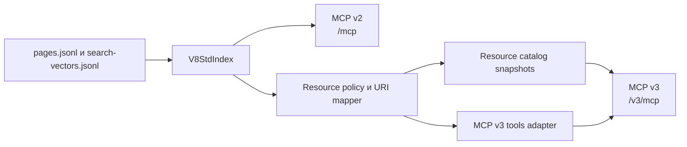

# ADR-0001: Версионированный resource-first MCP v3

- Статус: принято
- Дата: 2026-08-14
- Область: публичный и локальный MCP v8std

## Контекст

Текущий MCP v2 реализован в
[`scripts/v8std_mcp_server.py`](https://github.com/zeegin/v8std/blob/main/scripts/v8std_mcp_server.py)
и предоставляет:

- пять инструментов, включая `v8std_get_page`;
- три агрегированных ресурса: `llms.txt`, `llms-full.txt`, `pages.jsonl`;
- endpoint `/mcp`;
- stateless Streamable HTTP;
- периодическое обновление индекса.

Чтение отдельной страницы сейчас моделируется инструментом, хотя MCP имеет
отдельный примитив Resources. Claude Code поддерживает просмотр ресурсов через
`@`, автоматическую загрузку и операции list/read. Claude.ai и Claude Desktop
также поддерживают текстовые и бинарные MCP Resources.

Цель новой версии — перенести чтение полного Markdown страницы из
`v8std_get_page` в `resources/read`, сохранить поиск и специализированные
инструменты, а также не нарушить работу существующих клиентов v2.

## Рассмотренные варианты

### Изменить `/mcp` на месте

Отклонено. Удаление `v8std_get_page` сломает существующих клиентов, в том числе
клиентов без поддержки Resources.

### Согласовывать версию на одном endpoint

Отклонено. MCP не предоставляет стандартного механизма выбора прикладной версии
контракта. Кеширование схем инструментов клиентами сделало бы поведение
непредсказуемым.

### Добавить отдельный `/v3/mcp`

Принято:

- `/mcp` продолжает обслуживать v2;
- `/v3/mcp` предоставляет resource-first контракт;
- версии разворачиваются и откатываются независимо;
- пользователь переходит на v3 явным изменением URL подключения.

## Решение



В production v2 и v3 запускаются отдельными процессами или контейнерами из
одного образа. Они читают одни опубликованные AI-артефакты, но не разделяют
runtime-состояние. Ошибка запуска или обновления v3 не должна останавливать v2.

`stateless_http` означает отсутствие привязки запросов к клиентской сессии, а не
запрет серверного кеша. Snapshot каталога является общим неизменяемым кешем
процесса и не содержит пользовательского состояния.

Сам ADR помечен `llms.ignore: true`: архитектурное решение не является
пользовательским материалом v8std и не должно менять состав `pages.jsonl`.

## Контракты версий

| Возможность | `/mcp` v2 | `/v3/mcp` |
|---|---:|---:|
| `v8std_search` | да | да |
| `v8std_get_page` | да | нет |
| `v8std_get_related` | да | да |
| `v8std_explain_snippet` | да | да |
| `v8std_explain_diagnostics` | да | да |
| Агрегированные ресурсы | да | нет |
| Постраничные ресурсы | нет | да |
| Пагинация `resources/list` | не требуется | да |
| Resource templates | нет | да |
| Уведомления об изменениях | нет | нет |
| Подписки | нет | нет |

V2 не получает новых типов ресурсов и не меняет схемы инструментов.

## URI ресурсов

URI содержит язык корпуса. Первая реализация публикует только `ru`:

```text
v8std://ru/...
```

Префикс резервирует стабильное пространство имён для будущего английского
корпуса без изменения идентичности русских страниц:

```text
v8std://en/standards/437
```

Страница `lang` не связана с локалью URI: это статья о встроенном языке 1С.

Публичные HTML и Markdown URL остаются отдельными полями. Они не используются
как MCP resource URI, потому что чтение должно гарантированно проходить через
`resources/read`, а не зависеть от способности клиента самостоятельно загрузить
веб-страницу.

### Шаблоны

V3 публикует четыре шаблона:

```text
v8std://ru/standards/{number}
v8std://ru/diagnostics/{family}/{code}
v8std://ru/patterns/{family}
v8std://ru/patterns/{family}/{slug}
```

Примеры конкретных URI:

```text
v8std://ru/standards/437
v8std://ru/diagnostics/acc/1245
v8std://ru/diagnostics/bslls/UsingModalWindows
v8std://ru/diagnostics/v8cs/event-handler-boolean-param
v8std://ru/patterns/gof
v8std://ru/patterns/gof/adapter
```

Допустимые семейства диагностик:

```text
acc
bslls
v8cs
```

URI паттерна формируется по публичному пути. Поэтому в URI используются дефисы,
даже если внутренний ID содержит подчёркивания:

```text
patterns:engineering:rule_of_three
-> v8std://ru/patterns/engineering/rule-of-three
```

Корневая страница паттернов является конкретным ресурсом:

```text
v8std://ru/patterns
```

### Конкретные ресурсы без шаблонов

```text
v8std://ru/diagnostics/autoformat
v8std://ru/provenance/third-party-diagnostic-articles
v8std://ru/lang
v8std://ru/metod8dev/3266
v8std://ru/metod8dev/4105
```

Для `lang` и `metod8dev` шаблоны не регистрируются.

### Страницы, исключённые из Resources

Следующие страницы не являются MCP Resources:

```text
mcp
search_help
support
```

Они:

- отсутствуют в `resources/list`;
- не читаются через `resources/read`;
- не имеют `resource_uri`;
- не возвращаются как `resource_link`.

Они могут оставаться результатами `v8std_search` с публичным URL. Это отделяет
поисковую видимость сайта от доступности через Resources.

Универсальный шаблон `v8std://page/{id}` запрещён: он скрывал бы тип страницы и
позволял бы обойти правила исключения.

## Пагинация `resources/list`

На момент принятия ADR корпус содержит:

| Категория | Количество |
|---|---:|
| Стандарты | 318 |
| Диагностики | 1049 |
| Паттерны | 48 |
| Прочие разрешённые страницы | 5 |
| Всего Resources | 1420 |

Числа являются проверочной базой на момент принятия решения, а не постоянным
ограничением. Реализация рассчитывает состав каталога из актуального индекса и
политики видимости.

`resources/list` перечисляет конкретные дескрипторы всех разрешённых страниц,
включая страницы, которые читаются через шаблоны. Это обеспечивает поиск через
`@` и не требует отдельного ресурса `v8std://catalog`.

### Размер страницы

Сервер возвращает не более 200 ресурсов за один запрос. Стандартный запрос
`resources/list` не имеет параметра `limit`, поэтому размер задаётся сервером и
не конфигурируется клиентом.

### Snapshot и cursor

Перед первой страницей сервер:

1. При необходимости обновляет индекс.
2. Строит неизменяемый список дескрипторов.
3. Сортирует его по `uri`.
4. Рассчитывает revision:

```text
sha256(resource-schema-version + index-sha256 + visible-resource-policy)
```

Cursor является непрозрачным Base64URL-представлением версии формата, revision и
позиции:

```json
{
  "v": 1,
  "revision": "...",
  "offset": 200
}
```

Сервер хранит текущий и предыдущий snapshot. Поэтому обновление индекса между
страницами не создаёт пропусков, повторов или смешивания версий каталога.

Если snapshot вытеснен или процесс перезапущен, старый cursor получает
`-32602 Invalid cursor`. Клиент начинает новый `resources/list` без cursor.

### Обновление списка

Push-механизм не реализуется:

- capability `listChanged` не объявляется;
- capability `subscribe` не объявляется;
- `notifications/resources/list_changed` не отправляется;
- `notifications/resources/updated` не отправляется.

Новый запрос без cursor видит свежий snapshot. Продолжение по cursor завершает
чтение того snapshot, с которого была начата пагинация.

## Дескриптор ресурса

Каждая запись `resources/list` содержит:

```json
{
  "uri": "v8std://ru/standards/437",
  "name": "std437",
  "title": "Оформление текстов запросов #std437",
  "description": "Краткое описание стандарта",
  "mimeType": "text/markdown",
  "size": 12345
}
```

`size` равен размеру результата `resources/read` в UTF-8 байтах.

`lastModified` не публикуется: текущий индекс не содержит достоверной даты
изменения каждой страницы. Время загрузки или генерации индекса не является
датой изменения страницы и поэтому не используется как подмена.

## `resources/read`

Чтение возвращает полный Markdown без обрезки:

```markdown
---
id: std437
type: standard
resource_uri: v8std://ru/standards/437
canonical_url: https://v8std.ru/std/437/
markdown_url: https://v8std.ru/std/437.md
---

# Оформление текстов запросов
...
```

Максимальная текущая страница содержит около 26 тысяч символов, поэтому прежний
`body_limit` в v3 не нужен. Ограничение размера проверяется при генерации и в CI;
runtime не должен молча обрезать ресурс.

Правила чтения:

- URI разбирается строго по типизированной схеме;
- URL декодируется ровно один раз;
- запрещены `..`, дополнительные `/`, query и fragment;
- aliases и публичные URL в `resources/read` не принимаются;
- неизвестный или исключённый URI возвращает `-32002 Resource not found`;
- сервер никогда не загружает произвольный переданный URL.

## Результаты инструментов v3

Успешный вызов инструмента возвращает:

1. `structuredContent` с машинными данными, соответствующими опубликованной
   `outputSchema` инструмента.
2. Отдельные `ResourceLink` в `content` для доступных страниц.

Сериализованная копия `structuredContent` в `TextContent` не возвращается. MCP
рекомендует такое дублирование для обратной совместимости, но v3 намеренно
меняет контракт, а совместимая поверхность сохраняется на `/mcp` v2. Клиенты v3
обязаны поддерживать `structuredContent` и Resources.

Если результат не содержит доступных ресурсов, `content` является пустым
массивом, а данные остаются в `structuredContent`. `TextContent` используется
только для вызовов с `isError: true`, чтобы модель получила понятное описание
ошибки и способ исправить параметры.

Вводится инвариант: каждый `resource_link`, возвращённый инструментом, обязательно
присутствует в `resources/list` того же resource schema.

Пример структурированного результата поиска:

```json
{
  "schema_version": "v8std.tool-result.v3",
  "query": "модальные окна",
  "results": [
    {
      "id": "std404",
      "type": "standard",
      "title": "Модальные окна",
      "public_url": "https://v8std.ru/std/404/",
      "markdown_url": "https://v8std.ru/std/404.md",
      "resource_uri": "v8std://ru/standards/404",
      "score": 5021.4,
      "match_reasons": ["exact_alias"]
    }
  ]
}
```

Следом в `content` передаётся ссылка:

```json
{
  "type": "resource_link",
  "uri": "v8std://ru/standards/404",
  "name": "std404",
  "title": "Модальные окна",
  "mimeType": "text/markdown"
}
```

Такая адаптация применяется к:

- результатам `v8std_search`;
- исходной и связанным страницам `v8std_get_related`;
- стандартам и диагностикам `v8std_explain_snippet`;
- диагностикам и стандартам `v8std_explain_diagnostics`.

Тело страницы не встраивается в результат инструмента: иначе
`v8std_get_page` фактически вернулся бы под другим именем.

## Компоненты реализации

### `ResourceVisibilityPolicy`

Определяет:

- какие страницы входят в Resources;
- какие страницы читаются через шаблон;
- какие страницы регистрируются как конкретные ресурсы;
- какие страницы остаются только поисковыми результатами.

### `ResourceUriMapper`

Выполняет строгое двустороннее преобразование:

```text
page -> canonical resource URI
resource URI -> page identity
```

Mapper не использует произвольный alias resolution.

### `ResourceCatalog`

Отвечает за:

- построение дескрипторов;
- стабильную сортировку;
- snapshot revision;
- кодирование и проверку cursor;
- хранение двух snapshot;
- формирование полного Markdown ресурса.

### `V3ToolResultAdapter`

Добавляет `resource_uri`, создаёт `ResourceLink`, проверяет данные по
`outputSchema` и возвращает `CallToolResult` без дублирующего JSON в
`TextContent`.

### `V8StdResourceFastMCP`

Небольшой наследник FastMCP:

- переопределяет `list_resources` с поддержкой cursor;
- переопределяет `read_resource` с правильными MCP-кодами ошибок;
- возвращает четыре шаблона;
- использует обычную регистрацию FastMCP для четырёх инструментов.

Это необходимо, потому что закреплённый `mcp==1.27.0` в базовом
`FastMCP.list_resources()` возвращает весь список и не принимает cursor.
Зависимость от этого SDK-контракта закрепляется интеграционными тестами.

Новая реализация размещается отдельно от v2:

```text
scripts/v8std_mcp_resources.py
scripts/v8std_mcp_v3_server.py
```

Публичные методы `V8StdIndex`, используемые v2, не меняют свои схемы результатов.

## Развёртывание

Предлагаемая маршрутизация:

```text
https://ai.v8std.ru/mcp
    -> v8std-mcp-v2:8765

https://ai.v8std.ru/v3/mcp
    -> v8std-mcp-v3:8766
```

Дополнительные endpoint v3:

```text
/v3/healthz
/v3/version
```

`/v3/version` возвращает как минимум:

```json
{
  "service": "v8std-mcp",
  "api": "v3",
  "resource_schema": 1,
  "resource_revision": "...",
  "row_count": 1423,
  "resource_count": 1420
}
```

При неудачном обновлении:

- если последнего исправного snapshot нет, health возвращает `503`;
- если snapshot есть, health возвращает `200` и `degraded: true`;
- последняя исправная версия продолжает обслуживаться.

## Совместимость и откат

- `/mcp` не перенаправляется на v3;
- v2 не получает дату удаления;
- v3 сначала разворачивается как canary;
- откат удаляет только маршрут `/v3/mcp`;
- v2 остаётся рабочим независимо от состояния v3;
- клиенты без Resources продолжают использовать v2.

## Наблюдаемость

V3 сохраняет текущую телеметрию инструментов и добавляет агрегированные события:

- `resource_list` без содержимого страниц;
- `resource_read` с `resource_uri`, page ID и типом;
- revision и API version в health/version.

Полный Markdown, поисковые фрагменты кода и тела диагностических отчётов в
usage-log не записываются.

Версионированная схема usage events, безопасная публичная проекция сайта и
локальный операторский отчёт определены в
[ADR-0002](0002-mcp-monitoring-dashboard.md). Контракт локальной генерации
OpenMetrics без подключения Prometheus определён в
[ADR-0003](0003-mcp-openmetrics-exposition.md).

## Тестирование

Обязательные проверки:

1. Golden contract v2: те же пять инструментов и три ресурса.
2. V3 не содержит `v8std_get_page`.
3. `resources/templates/list` возвращает ровно четыре шаблона.
4. Все 1420 ресурсов перечисляются ровно один раз.
5. Переход между страницами snapshot не создаёт пропусков и повторов.
6. Обновление индекса не меняет уже начатую пагинацию.
7. Все URI проходят `page -> URI -> page`.
8. `mcp`, `search_help`, `support` отсутствуют в Resources.
9. Неизвестные и поддельные URI возвращают `-32002`.
10. Неверные и устаревшие cursor возвращают `-32602`.
11. Каждый `resource_link` из инструментов присутствует в `resources/list`.
12. Успешные tool results не содержат JSON-копию в `TextContent`.
13. `structuredContent` каждого инструмента соответствует его `outputSchema`.
14. `resources/read` возвращает полный, необрезанный Markdown.
15. Capabilities содержат Resources, но не subscriptions и не `listChanged`.
16. Проверка протокола через MCP Inspector.
17. Проверка `@` и автоматического чтения в Claude Code.
18. Проверка custom connector в Claude.ai или Claude Desktop.
19. Полный набор unit-тестов репозитория.
20. `./scripts/zensical_docs.sh build --strict`.

Числовые проверки должны вычислять ожидаемый состав из fixture и политики
видимости. Значения 1423/1420 используются как проверка текущего
сгенерированного артефакта, но не зашиваются как вечные константы реализации.

## План выпуска

1. Добавить URI mapper, visibility policy и unit-тесты.
2. Добавить snapshot-каталог и пагинацию.
3. Добавить `resources/read` и шаблоны.
4. Добавить адаптацию результатов четырёх инструментов.
5. Поднять локальный v3 независимо от v2.
6. Проверить MCP Inspector, Claude Code и Claude connector.
7. Развернуть закрытый production canary.
8. Опубликовать `/v3/mcp` и документацию подключения.
9. Наблюдать ошибки, чтения ресурсов и использование v2/v3.

Каждая стадия может быть отменена без изменения `/mcp`.

## Последствия

Положительные:

- чтение документов переносится в предназначенный для этого примитив MCP;
- полный каталог доступен через `@`;
- из v3 исчезает дублирующий `v8std_get_page`;
- страницы получают стабильные типизированные URI;
- v2 сохраняет совместимость;
- v3 можно откатить независимо.

Отрицательные:

- требуется два runtime-сервиса;
- пагинация требует отдельного адаптера поверх FastMCP;
- tool-only клиенты не смогут использовать v3 для полного чтения;
- открытый клиент увидит новый состав при следующем обновлении списка, а не по
  push-уведомлению.

## Не входит в решение

- удаление или срок отключения v2;
- авторизация;
- MCP Apps или UI;
- prompts;
- subscriptions и notifications;
- публикация английского корпуса;
- изменение алгоритма поиска;
- изменение содержания стандартов и диагностик.

## Источники

- [MCP Resources specification](https://modelcontextprotocol.io/specification/2025-11-25/server/resources)
- [MCP Tool Resource Links](https://modelcontextprotocol.io/specification/2025-11-25/server/tools#resource-links)
- [Claude Code MCP resources](https://code.claude.com/docs/en/mcp#use-mcp-resources)
- [Claude tool structured content](https://code.claude.com/docs/en/agent-sdk/custom-tools#return-structured-data)
- [Claude custom connector capabilities](https://claude.com/docs/connectors/building#protocol-features)
