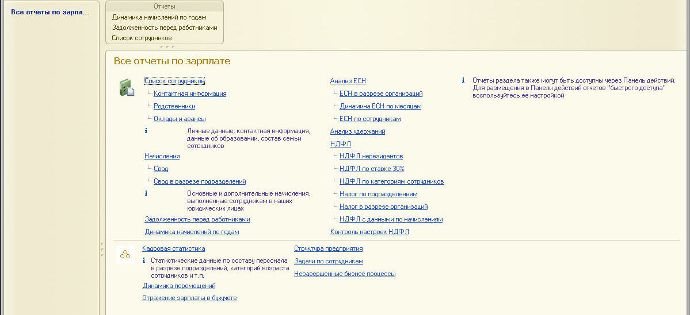

###### #std401

# Размещение большого количества команд в основном окне приложения

В конфигурациях может возникать проблема,
когда в панели действий нужно разместить слишком много команд.

Чаще всего это относится к командам формирования отчетов.
Для большого числа команд
панель действий использовать неэффективно.

Рекомендуемый подход:

###### 1.

Проанализируйте все команды отчетов,
отнесенные к определенной подсистеме
(включая вложенные подсистемы).

- Для большинства команд
  снимите видимость по умолчанию.
- Для некоторых,
  наиболее востребованных отчетов,
  оставьте видимость по умолчанию.
- При необходимости
  настройте видимость команд по ролям.
  Для самого "полноправного" пользователя
  число команд,
  видимых по умолчанию в панели действий,
  не должно превышать `6-9`.

###### 2.

Для подсистемы верхнего уровня
реализуйте общую форму,
в название которой входит имя подсистемы,
например,
`Все отчеты по зарплате`.

В этой форме разместите все команды
соответствующей подсистемы.

- Реализуйте команды как гиперссылки.
- Добавьте "отсылку" к настройке панели действий.
- При необходимости
  разместите команды смежных областей,
  то есть реализуйте подобие раздела `См. также`.

###### 3.

Реализуйте общую команду,
например,
`ВсеОтчетыПоЗарплате`.

- Код команды должен просто открывать общую форму:

```bsl
ОткрытьФорму("ОбщаяФорма.ВсеОтчетыПоЗарплате", ,
    ПараметрыВыполненияКоманды.Источник,
    ПараметрыВыполненияКоманды.Уникальность,
    ПараметрыВыполненияКоманды.Окно)
```

- Название команды должно подчеркивать,
  что она охватывает все отчеты,
  например,
  `Все отчеты по зарплате`.
- Включите команду в состав подсистемы верхнего уровня.
- Отнесите команду к одной из групп панели навигации.

На рисунке ниже - пример внешнего вида основного окна приложения
при выполнении команды `Все отчеты по зарплате`.



###### Источник

https://its.1c.ru/db/v8std#content:401
