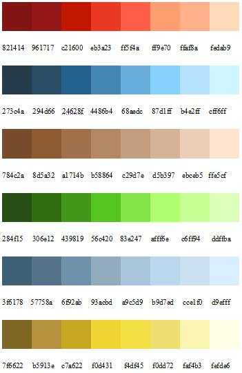
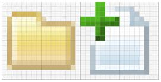
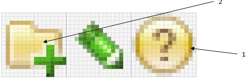

###### #std423

# Правила создания иконок командных панелей

Руководство по созданию иконок командных панелей.

Руководство рассчитано на использование
с продуктами `Adobe Photoshop`
и `Axialis IconWorkshop`.

## Палитра

{ width="351" }

Палитра предполагает использование серого
от `#4D4D4D` до `#FFFFFF`,
а также промежуточных цветов смешения.

## Проекция

Для лучшей разборчивости
элементы маленьких иконок
отображаются во фронтальной проекции,
без перспективы.

## Размер

Иконки командной панели имеют размер `16x16`.

Изображение не обязано занимать все доступное пространство.
Важно,
чтобы иконки имели примерно одинаковый визуальный вес,
а их центр тяжести располагался
на одной горизонтальной линии.

{ width="271" }

## Элементы стиля

{ width="507" }

1. `Обводка`.
   Элементы имеют обводку толщиной `1` пиксель,
   с закругленными углами.
   Технически обводка реализуется растушевкой с альфа-каналом.
   Прозрачность - от `10` до `50%`.
   На углах прозрачный пиксель - от `5` до `15%`.
2. `Контур`.
   Для повышения читаемости
   от модификатора идет внешний дополнительный контур
   шириной `1` пиксель.
   Подсветка может располагаться:
   снизу,
   справа-внизу
   или по всему периметру
   (на усмотрение художника).
   Интенсивность подсветки подбирается индивидуально.
3. `Тени`.
   Собственные и падающие тени отсутствуют.
4. `Модификаторы`.
   Используются в основном зеленый и синий цвета.
   Исключение - модификаторы "опасности".

## Направление света

Источник света считается расположенным вверху.

Поэтому обводка закрашивается вертикальным градиентом
(обычно от `2-го` до `5-го` цвета из палитры).

На лицевой стороне объектов допустим:

- вертикальный градиент;
- градиент из верхнего левого угла
  в нижний правый
  (на усмотрение художника).

###### Источник

https://its.1c.ru/db/v8std#content:423
