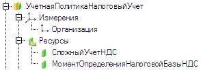

###### #std470

# Использование функциональных опций

###### 1.1.

Если часть функциональности конфигурации может быть необязательной,
управляйте ее доступностью через функциональные опции.

Значения функциональных опций храните в данных информационной базы
(например, в константах).

!!! example "Пример настройки для опционального версионирования"

    - Создать функциональную опцию `ИспользоватьВерсионированиеОбъектов`.
    - Создать константу `ИспользоватьВерсионированиеОбъектов` типа `Булево`.
    - В свойстве `Хранение` функциональной опции указать эту константу.

После этого объекты конфигурации можно включать в состав функциональной опции,
а в коде использовать `#!bsl ПолучитьФункциональнуюОпцию()`:

```bsl
ИспользуетсяМеханизмВерсионирования =
    ПолучитьФункциональнуюОпцию("ИспользоватьВерсионированиеОбъектов");
```

Функциональные опции автоматически влияют на доступность элементов интерфейса.
Также они могут управлять бизнес-логикой, и не только для типа `Булево`.

###### 1.2.

Доступность функциональности можно задавать не только для всей базы,
но и по контексту (например, по организации).

!!! example "Пример параметризованной функциональной опции"

    Для управления сложным учетом НДС по организациям:

    - создать функциональную опцию `УчетнаяПолитикаСложныйУчетНДС`;
    - создать параметр функциональной опции `Организация`;
    - создать регистр сведений `УчетнаяПолитикаНалоговыйУчет`
      с измерением `Организация` и нужными ресурсами;
    - в свойстве `Хранение` функциональной опции указать ресурс `СложныйУчетНДС`;
    - для параметра `Организация` в свойстве `Использование` указать
      измерение `Организация` регистра `УчетнаяПолитикаНалоговыйУчет`.

!!! example "Пример структуры хранения"

    { width="294" }

Чтобы значение опции соответствовало контексту формы,
устанавливайте параметры функциональных опций формы:

```bsl
УстановитьПараметрыФункциональныхОпцийФормы(
    Новый Структура("Организация", <ТребуемаяОрганизация>));
```

Для управления доступностью кода по такой опции получайте значения с параметрами:

```bsl
ПараметрыУчетнойПолитики = Новый Структура("УчетнаяПолитикаОрганизация", <ТребуемаяОрганизация>);
СложныйУчетНДС = ПолучитьФункциональнуюОпцию("УчетнаяПолитикаСложныйУчетНДС", ПараметрыУчетнойПолитики);
МоментОпределенияНалоговойБазыНДС = ПолучитьФункциональнуюОпцию(
    "УчетнаяПолитикаМоментОпределенияНалоговойБазыНДС", ПараметрыУчетнойПолитики);
```

!!! tip "Примечание"

    Приведенный вариант не является единственным.
    Для сложных сценариев сверяйтесь с документацией платформы `1С:Предприятие`.

###### 1.3.

Не используйте функциональные опции не по назначению.

- Не создавайте их только для видимости элементов одной конкретной формы.
  Функциональные опции управляют доступностью функциональности в конфигурации целиком.
- Не используйте их для оптимизации доступа к данным (как серверное хранилище значений).
  Для этого используйте [#std724: Использование модулей с повторным использованием возвращаемых значений](724.md).

## Установка и получение значений функциональных опций

###### 2.1.

Платформа не предоставляет отдельного механизма установки функциональных опций.
Значение функциональной опции задается изменением хранимых данных:
констант, элементов справочников или записей регистров сведений.

В конфигурации нужно реализовать соответствующий интерфейс настройки.

###### 2.2.

Для параметризованных опций учитывайте правила вычисления значения:

- если записи, соответствующей параметру, нет, опция считается выключенной;
- если подходящих записей несколько, итоговое значение складывается по `#!bsl ИЛИ`.

###### 2.3.

Если опция хранится в ресурсе периодического регистра сведений,
значение берется через срез последних.

Если нужно получать значение на другую дату,
устанавливайте параметр функциональной опции `Период` типа `Дата`:

```bsl
УстановитьПараметрыФункциональныхОпцийФормы(
    Новый Структура("Организация, Период", <ТребуемаяОрганизация>, <ТребуемаяДата>));
```

При этом:

- значение `Период` предварительно приводите к интервалу периодичности регистра (для выполнения [п. 2.5](#25));
- параметр `Период` в метаданных не создавайте, он предоставляется платформой автоматически.

```bsl
НачалоМесяца(<ТребуемаяДата>)
```

###### 2.4.

Изменение значения функциональной опции не обновляет командный интерфейс автоматически.
После изменения вызывайте `#!bsl ОбновитьИнтерфейс`.

###### 2.5.

Значения функциональных опций кешируются на сервере.
Слишком большой кеш может ухудшить производительность.

Не параметризуйте функциональные опции данными с очень большим числом значений
(например, конкретным контрагентом или товаром).

Рекомендуется параметризовать по признакам,
например по `ВидКонтрагента`, а не по самому контрагенту.

## Зависимые функциональные опции

###### 3.1.

Если одна функциональность зависит от других,
обеспечьте непротиворечивость связанных данных.

!!! example "Пример"

    Функциональность `Перевод сотрудников` доступна,
    когда одновременно включены `Многофирменный учет` и `Кадровый учет`.

    В таком случае:

    - введите отдельную функциональную опцию `ПереводСотрудников`;
    - привяжите нужные объекты к ней;
    - реализуйте зависимость ее значения от двух других опций
      (например, при записи соответствующих констант).

Показывайте администратору в форме настройки значения всех зависимых опций.
При этом производную опцию (например, `ПереводСотрудников`) делайте недоступной для ручного редактирования.

Для булевых опций используйте элемент управления `Поле` вида `Поле флажка`
с заголовком, совпадающим с названием опции.

###### 3.2.

Для взаимоисключающих функциональных опций используйте элементы,
позволяющие выбрать одно значение из нескольких:

- `Поле переключателя`;
- `Поле ввода` со списком выбора;
- другой аналогичный элемент выбора.

Заголовки переключателей или значения списка должны совпадать с названиями опций.

###### 3.3.

Если незначительная функциональность сложно зависит от нескольких опций
и ее нельзя назвать понятно для пользователя,
лучше не вводить отдельную функциональную опцию.

В таких случаях зависимость элементов формы реализуйте в коде
(например, при создании формы на сервере),
анализируя значения существующих опций.

## Ограничения на использование параметров функциональных опций

###### 4.1.

По соображениям производительности не рекомендуется иметь более `10` параметров функциональных опций.

Не создавайте разные параметры для одной смысловой нагрузки.

!!! example "Пример"

    Вместо двух параметров:

    - `ТипВерсионируемогоОбъекта` (связан с `РегистрСведений.НастройкаВерсионированияОбъектов.Измерение.ТипОбъекта`);
    - `ТипОбъектаСДополнительнымиОтчетамиИОбработками` (связан с `РегистрСведений.НазначениеДополнительныхОбработок.Измерение.ТипОбъекта`);

    используйте один параметр `ТипОбъектаКонфигурации`,
    связанный с измерениями обоих регистров.

###### 4.2.

При проектировании состава функциональных опций и их параметров придерживайтесь схемы:

- определить, какая функциональность действительно опциональна;
- определить, где нужен один общий выключатель, а где параметризация по контексту;
- составить список всех параметризованных опций и их параметров;
- исключить дубли параметров одного типа и назначения;
- если параметров слишком много, ранжировать их по востребованности и важности;
- исключить менее востребованные параметры;
- для опций без параметров принять решение:
  сделать их непараметризованными (включение по базе в целом) или удалить.

Итогом должен быть ограниченный и управляемый набор параметров функциональных опций.

###### См. также

- [#std491: Влияние изменения значений параметров сеанса и функциональных опций на производительность механизма ограничения доступа к данным](491.md)

###### Источник

https://its.1c.ru/db/v8std#content:470
