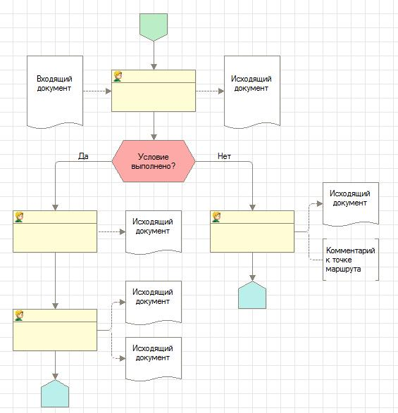
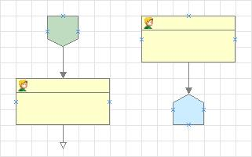
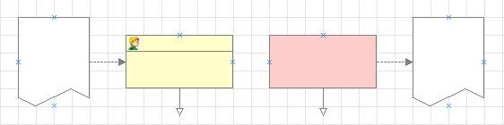
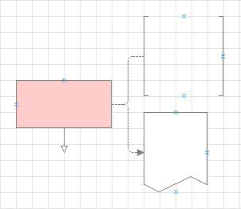
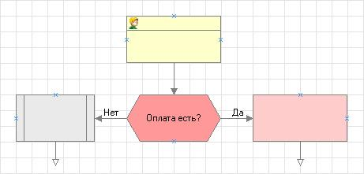

###### #std480

# Оформление карты маршрута бизнес-процесса

Пример оформления бизнес-процесса:

{ width="565" }

###### 1. 

## Общие рекомендации

###### 1.1.

Бизнес-процессы рисуйте сверху вниз. Другая ориентация (например, слева направо) допустима, если так процесс получается нагляднее.

###### 1.2.

Используйте стандартную сетку: шаг 20 точек, линии сетки включены.

###### 1.3.

Не используйте жирные и разноцветные шрифты.

###### 1.4.

Количество изгибов соединительных линий должно быть минимальным. Если точки можно соединить линией с одним изгибом, выбирайте этот вариант, подгоняя размеры и положение точек.

###### 1.5.

При размещении декораций и точек маршрута соблюдайте отступ в одну клетку от левого и верхнего края карты маршрута.

###### 1.6.

Ширину точек маршрута делайте равной четному количеству клеток. Это нужно, чтобы соединительные линии сходились без лишних изгибов.

Размеры точек и декораций старайтесь приближать к пропорциям спичечного коробка (например, 3х6 клеток). Избегайте сильно вытянутых по вертикали или горизонтали точек: они ухудшают восприятие схемы.

###### 1.7.

Текст в точках маршрута и декорациях выравнивайте по центру (по умолчанию). Исключение: комментарии, для них лучше использовать выравнивание влево.

###### 1.8.

Размещайте декорации и точки маршрута так, чтобы они не пересекали границы печатного листа (меню **Графическая схема - Режим просмотра страниц**).

###### 2.

## Рекомендации по оформлению отдельных элементов

###### 2.1.

Точки **Старт** и **Завершение** устанавливайте размером 2х2 клетки, без наименования. Количество таких точек определяется логикой бизнес-процесса.

Отступ от точки старта или завершения до ближайшей точки бизнес-процесса рекомендуется делать в две клетки.

{ width="321" }

###### 2.2.

Точки **Действие**, **Автоматическая обработка**, **Вложенный бизнес-процесс** должны иметь размер, достаточный для размещаемого текста.

Текст в этих точках должен быть короткой директивой и отвечать на вопрос «Что нужно сделать?» (например, «Выписать счет», а не «Выписка счета»).

Слева от этих точек располагайте декорации входящих данных, необходимых для выполнения действия. Справа располагайте декорации результирующих (исходящих) данных.

###### 2.3.

Изображения входящих документов располагайте слева от точки на расстоянии двух клеток и соединяйте с точкой пунктирной линией со стрелкой.

Изображения исходящих документов располагайте справа от точки на расстоянии двух клеток и соединяйте с точкой пунктирной линией со стрелкой.

Документы оформляйте фигурой вида «Документ».

{ width="562" }

Пропорции декорации документа по возможности приближайте к формату А4 (например, 4х5 или 3х4 клетки стандартной сетки).

###### 2.4.

Комментарии к точкам маршрута размещайте на расстоянии двух клеток:

- слева от точки, если комментарий относится к входящему документу;
- справа от точки, если комментарий относится к исходящему документу.

Комментарий оформляйте фигурой **Скобки вертикальные** или **Скобки горизонтальные** и соединяйте с гранью точки маршрута пунктирной линией без стрелки.

{ width="302" }

###### 2.5.

Точки условного перехода должны содержать короткий вопрос, заканчивающийся знаком вопроса.

Вопрос формулируйте так, чтобы ответ был только **Да** или **Нет** (например, **Счет есть?**, **Отгрузка разрешена?**, **ОК?**).

Точки условия делайте максимально компактными, но без потери наглядности: это точки перехода, а не точки действия.

Соединительные линии точек условия (входящие и исходящие) должны иметь суммарную длину не менее двух клеток, чтобы надписи **Да** и **Нет** читались нормально.

{ width="461" }

###### Источник

https://its.1c.ru/db/v8std#content:480
