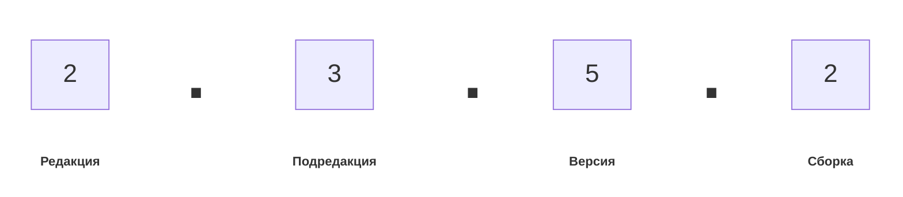

###### #std483

# Нумерация редакций и версий

###### 1.

Новая редакция получает следующий целый номер относительно предыдущей.
Формат обозначения: `Редакция.Подредакция` (например, `1.5`, `1.6`).
Для новой конфигурации стартовая редакция: `1.0`.

###### 2.

В пределах одной подредакции используйте сквозную нумерацию версий,
включая альфа, ознакомительные, бета и финальные выпуски.

Нумерация версий начинается с: `1`.

###### 3.

Полный номер версии указывается в свойстве `Версия` конфигурации
в формате:

`{Р|РР}.{П|ПП}.{З|ЗЗ}.{С|СС}`

Каждая часть содержит минимум одну цифру и при необходимости может быть длиннее.

!!! example "Пример"

    `1.6.4.7` — `7`-я сборка `4`-й версии редакции `1.6`.

###### См. также

- [#std484: Общие сведения о выпуске конфигураций](484.md)

###### Источник

https://its.1c.ru/db/v8std#content:483
