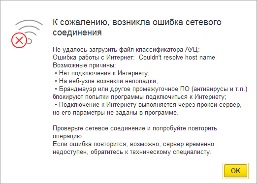

###### #std499

# Перехват исключений в коде

###### 1.

Не перехватывайте исключения без необходимости.

Необработанное исключение:

- выводится пользователю;
- записывается в журнал регистрации;
- при необходимости отправляется в сервис регистрации ошибок.

Для распространенных ошибок платформа уже содержит категории и шаблоны сообщений.
В сервис регистрации обычно отправляются ошибки программного кода,
например: `Значение не является значением объектного типа`,
`Поле объекта не обнаружено`, `Слишком много фактических параметров`,
`Ошибка при вызове метода контекста`.

###### 2.

Если технологический текст исключения непонятен пользователю,
дополняйте его прикладным пояснением, типовыми причинами и рекомендациями.

Это особенно важно для ошибок интеграции и внешних ресурсов:

- почтовые серверы;
- веб-сервисы;
- принтеры;
- криптопровайдеры;
- каналы связи.

###### 2.1.

В таких случаях допустимо перехватить и перевызвать исключение
с уточнением, но без потери исходной информации об ошибке.

Блоки `#!bsl Попытка ... Исключение` размещайте локально,
только вокруг потенциально проблемного вызова.

Не открывайте широкий блок `#!bsl Попытка` вокруг большого участка кода,
чтобы не перехватывать несвязанные ошибки соседнего кода.

!!! success "Правильно"

    ```bsl
    Попытка
        ЗагрузитьФайлИзИнтернета(...);
    Исключение
        ИнформацияОбОшибке = ИнформацияОбОшибке();
        ТекстСообщения = ОбработкаОшибок.СообщениеОбОшибкеДляПользователя(ИнформацияОбОшибке);
        ТекстСообщения = НСтр("ru = 'Не удалось загрузить файл классификатора АУЦ:'")
            + Символы.ПС + ТекстСообщения
            + Символы.ПС + НСтр("ru = 'Возможные причины:
            | • Нет подключения к Интернету;
            | • На веб-узле возникли неполадки;
            | • Брандмауэр или другое промежуточное ПО (антивирусы и т.п.) блокируют попытки программы подключиться к Интернету;
            | • Подключение к Интернету выполняется через прокси-сервер, но его параметры не заданы в программе.'");

        ДляАдминистратора = ДиагностикаСоединенияСИнтернет();
        ВызватьИсключение(ТекстСообщения, , , ДляАдминистратора, ИнформацияОбОшибке);
    КонецПопытки;
    ```

!!! tip "Рекомендация"

    Проверяйте, как исключение выглядит для пользователя, без отладки и без режима технического специалиста.
    В этих режимах поведение и внешний вид окна исключения различаются.

###### 2.2.

В особых сценариях (например, обработчики обновления информационной базы)
допустима собственная обработка исключения без `#!bsl ВызватьИсключение`.

В таком случае исключение не перевызывается, а обрабатывается.

!!! success "Правильно"

    - фильтруйте и отправляйте ошибки программного кода в сервис регистрации ошибок
      (см. `#!bsl ИнформацияОбОшибке.ЯвляетсяОшибкойКатегории()` и `#!bsl ОтчетОбОшибке.Отправить()`);
    - фиксируйте причину ошибки в журнале регистрации для диагностики администратором;
    - записывайте в журнал подробное представление исключения,
      а пользовательское сообщение добавляйте в текст ошибки
      (см. `#!bsl ОбработкаОшибок.ПодробноеПредставлениеОшибки()`
      и `#!bsl ОбработкаОшибок.СообщениеОбОшибкеДляПользователя()`).

!!! failure "Неправильно"

    не используйте `#!bsl ОписаниеОшибки()`;

!!! success "Правильно"

    `#!bsl ОбработкаОшибок.ПодробноеПредставлениеОшибки()`

!!! failure "Неправильно"

    не используйте `#!bsl ОбработкаОшибок.КраткоеПредставлениеОшибки()`

!!! success "Правильно"

    `#!bsl ОбработкаОшибок.СообщениеОбОшибкеДляПользователя()`.

###### 3.

Частные случаи некорректного перехвата исключений.

###### 3.1.

Не анализируйте текст исключения для интерпретации причины ошибки.

Текст исключения может меняться в зависимости от локализации
и версии платформы или конфигурации.

Текст пользователю выводите «как есть».
При необходимости добавляйте прикладное пояснение операции
и возможные причины.

!!! success "Пример"

    ```bsl
    Попытка
        ЗагрузитьФайлИзИнтернета(...);
    Исключение
        ИнформацияОбОшибке = ИнформацияОбОшибке();
        ТекстСообщения = ОбработкаОшибок.СообщениеОбОшибкеДляПользователя(ИнформацияОбОшибке);
        ТекстСообщения = НСтр("ru = 'Не удалось загрузить файл классификатора АУЦ:'")
            + Символы.ПС + ТекстСообщения
            + Символы.ПС + НСтр("ru = 'Возможные причины:
            | • Нет подключения к Интернету;
            | • На веб-узле возникли неполадки;
            | • Брандмауэр или другое промежуточное ПО (антивирусы и т.п.) блокируют попытки программы подключиться к Интернету;
            | • Подключение к Интернету выполняется через прокси-сервер, но его параметры не заданы в программе.'");

        ДляАдминистратора = ДиагностикаСоединенияСИнтернет();
        ВызватьИсключение(ТекстСообщения, , , ДляАдминистратора, ИнформацияОбОшибке);
    КонецПопытки;
    ```

Если в конфигурации используется БСП, применяйте `#!bsl ОбщегоНазначенияКлиентСервер.УточнениеИсключения()`:

!!! success "Пример с БСП"

    ```bsl
    Попытка
        ЗагрузитьФайлИзИнтернета(...);
    Исключение
        ИнформацияОбОшибке = ИнформацияОбОшибке();
        Уточнение = ОбщегоНазначенияКлиентСервер.УточнениеИсключения(
            ИнформацияОбОшибке,
            НСтр("ru = 'Не удалось загрузить файл классификатора АУЦ:'"));
        Уточнение.Текст = Уточнение.Текст
            + Символы.ПС + НСтр("ru = 'Возможные причины:
            | • Нет подключения к Интернету;
            | • На веб-узле возникли неполадки;
            | • Брандмауэр или другое промежуточное ПО (антивирусы и т.п.) блокируют попытки программы подключиться к Интернету;
            | • Подключение к Интернету выполняется через прокси-сервер, но его параметры не заданы в программе.'");

        ДляАдминистратора = ДиагностикаСоединенияСИнтернет();
        ВызватьИсключение(Уточнение.Текст, Уточнение.Категория, , ДляАдминистратора, ИнформацияОбОшибке);
    КонецПопытки;
    ```

!!! example "Иллюстрация"

    { width="522" }

###### 3.2.

Недопустимо перехватывать любые исключения бесследно для системного администратора.

!!! failure "Неправильно"

    ```bsl
    Попытка
        // код, приводящий к вызову исключения
        ...
    Исключение 
        // перехват любых исключений
    КонецПопытки;
    ```

Как правило, такая конструкция скрывает реальную проблему,
которую потом невозможно диагностировать.

!!! success "Правильно"

    ```bsl
    Попытка
        // код, приводящий к вызову исключения
        ...
    Исключение
        // Пояснение причин перехвата всех исключений «незаметно» от пользователя.
        // ...
        // И запись события в журнал регистрации для системного администратора.
        ЗаписьЖурналаРегистрации(
            НСтр("ru = 'Выполнение операции'"),
            УровеньЖурналаРегистрации.Ошибка,
            ,
            ,
            ОбработкаОшибок.ПодробноеПредставлениеОшибки(ИнформацияОбОшибке()));
    КонецПопытки;
    ```

###### 4.

Порядок обработки исключений при использовании транзакций
описан в стандарте [#std783: Транзакции: правила использования](783.md).

###### См. также

- [#std542: Доступ к файловой системе из кода конфигурации](https://its.1c.ru/db/v8std#content:542), удаление временных файлов.
- [#std783: Транзакции: правила использования](783.md)
- [#std400: Информирование пользователя](400.md)
- [#std585: Сообщения пользователю](585.md)

###### Источник

https://its.1c.ru/db/v8std#content:499
