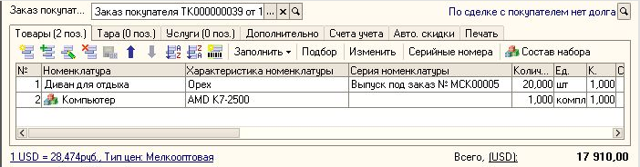

---
llms:
  ignore: true
---

###### #std516

# Кнопки

Кнопки размещаются
вне командных панелей.

Минимальный размер кнопок:
`60x19`.

Ширина кнопки
может увеличиваться
в зависимости от длины заголовка.

Надпись на кнопке
должна занимать одну строку.

## Оформление кнопок с часто употребимыми действиями (частотных кнопок)

Для оформления кнопок
с часто употребимыми действиями
рекомендуется использовать
текст совместно с картинкой.

Иконка на кнопке
может также использоваться
в строке табличной части
для дополнительной идентификации
типа данных,
к которому применима команда.

Пример:
форма реализации товаров и услуг,
кнопка `Состав набора`
(`Редактировать состав набора комплекта`).

!!! example "Пример"

    { width="702" }

<!-- diagnostic-backlinks:start clause=std516 -->

<a class="diagnostic-chip" href="../diagnostics/acc/113.md">acc:113</a>
<a class="diagnostic-chip" href="../diagnostics/acc/114.md">acc:114</a>
<a class="diagnostic-chip" href="../diagnostics/acc/115.md">acc:115</a>

<!-- diagnostic-backlinks:end clause=std516 -->

###### Источник

https://its.1c.ru/db/v8std#content:516
