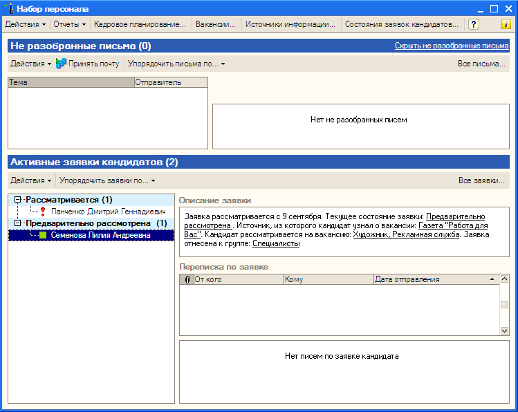
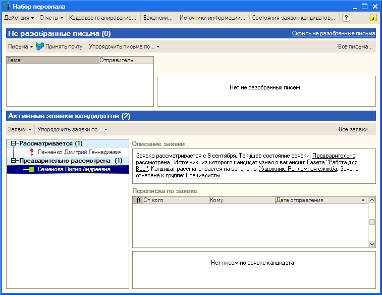

###### #std526

# Ограничения по использованию одинаковых текстов на элементах управления в форме

Рекомендуется воздерживаться
от размещения в форме
элементов управления
с одинаковым текстом.

Например,
два подменю `Действие`:
одно в табличной части,
второе в самой форме.

Совпадение текстов
элементов одного типа на форме:

- создает путаницу
  в действиях пользователя;
- затрудняет чтение
  и написание справки;
- может приводить
  к неопределенности
  при объяснении пользователем
  своих действий
  другим пользователям и специалистам.

Пример:
форма обработки набора персонала,
где изначально размещено
три подменю `Действия`
(для формы
и для каждого табличного поля).

!!! example "Пример"

    { width="749" }

Вариант этой же формы,
где подменю `Действие`
оставлено только для формы в целом.

!!! example "Пример"

    { width="757" }

###### Источник

https://its.1c.ru/db/v8std#content:526
