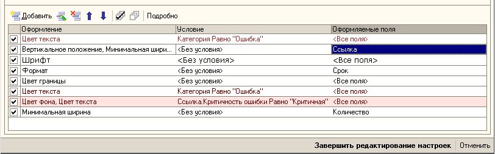
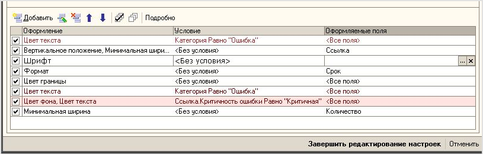

###### #std527

# Использование пояснений в полях ввода и выбора

Рекомендуется в полях ввода
или выбора,
если они еще не заполнены,
показывать пользователю:

- значение по умолчанию;
- или трактовку
  пустого значения этого поля.

!!! example "Примеры"

    { width="812" }
    { width="815" }

###### Источник

https://its.1c.ru/db/v8std#content:527
