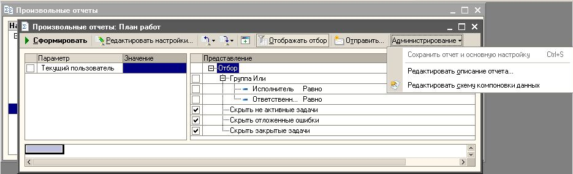

###### #std528

# Особенности размещения в командных панелях пунктов меню, не предназначенных для решения основных задач

Рекомендуется пункты меню,
которые не предназначены
для решения основных задач,
а выполняют команды
для специализированных целей
или особой группы пользователей,
помещать в подменю.

!!! example "Пример"

    { width="935" }

###### Источник

https://its.1c.ru/db/v8std#content:528
