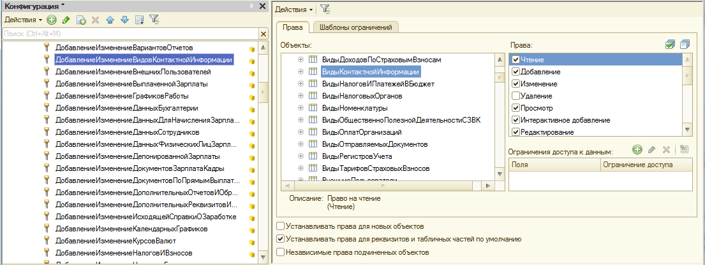

###### #std532

# Установка прав для новых объектов и полей объектов

###### 1.

При разработке ролей выбирайте методику установки прав, которая не допускает появления ролей с доступом к полям объекта без доступа к самому объекту.

Это помогает избежать проблем на внедрении, когда пользователю по ошибке выдают роль с доступом ко всем реквизитам объекта метаданных.

###### 2.

- [x] `Устанавливать права для новых объектов` должен быть установлен только у роли `ПолныеПрава`.

###### 3.

При добавлении новой роли:

- [x] `Устанавливать права для реквизитов и табличных частей по умолчанию` должен быть установлен;
- [ ]  `Независимые права подчиненных объектов` должен быть снят.

###### 4.

Если нужно дать права только на поля объекта метаданных (просмотр/редактирование реквизитов, табличных частей, измерений, команд и т.п.) без прав на сам объект, сначала:

- [x] `Независимые права подчиненных объектов` установите флажок;
- [ ]  `Устанавливать права для реквизитов и табличных частей по умолчанию` снимите флажок с очисткой прав на все реквизиты и табличные части.

###### 5.

При добавлении новых объектов или новых полей существующих объектов обязательно настраивайте права на них в соответствующих ролях.

###### Пример

Пример настройки прав в роли `ДобавлениеИзменениеВидовКонтактнойИнформации`:

{ width="1105" }

###### Проверки

~[#acc:145](../diagnostics/acc/145.md)~
~[#acc:146](../diagnostics/acc/146.md)~
###### Источник

https://its.1c.ru/db/v8std#content:532
