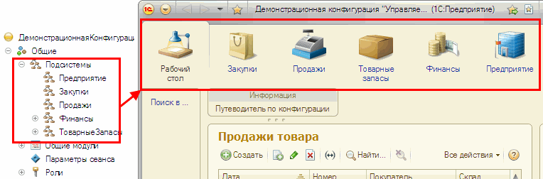

###### #std543

# Использование подсистем

###### 1.

Подсистемы решают две задачи:

- формируют разделы командного интерфейса;
- группируют объекты метаданных по функциональному признаку для разработки.

###### 1.1.

Если структура интерфейса и функциональная структура совпадают, можно использовать одну и ту же иерархию подсистем.

Для таких подсистем флажок `Включать в командный интерфейс` должен быть установлен.

{ width="764" }

Например, разделы интерфейса `Закупки`, `Продажи` и т.д. можно одновременно использовать для отбора объектов в Конфигураторе, переноса объектов и ограничения области глобального поиска.

###### 1.2.

Если логическая группировка объектов не совпадает с разделами интерфейса, создавайте отдельную иерархию «функциональных» подсистем.

Для таких подсистем флажок `Включать в командный интерфейс` должен быть снят.

Примеры:

- справочник `Номенклатура` логически относится к подсистеме `Нормативно-справочная информация`, но в интерфейсе может использоваться в нескольких разделах;
- в раздел `Настройка и администрирование` выносите команды открытия списков объектов из «функциональных» подсистем, отвечающих за администрирование.

###### 1.3.

Объекты без визуального представления в командном интерфейсе (общие модули, регламентные задания, константы, подписки на события и т.п.) включайте только в «функциональные» подсистемы.

###### См. также

- [Панель разделов](https://its.1c.ru/db/v8std#content:567:hdoc)

###### Источник

https://its.1c.ru/db/v8std#content:543
