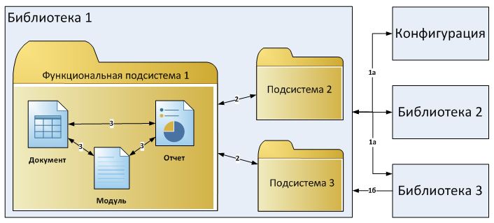

###### #std551

# Разработка конфигураций с повторным использованием общего кода и объектов метаданных

###### 1.

При разработке нескольких конфигураций (например, линейки продуктов) общий код и общие объекты метаданных выносите в библиотеки.

Библиотека — это конфигурация, которая не предназначена для конечных пользователей.
Она нужна для поддержки других конфигураций и содержит общую функциональность.

Библиотечный подход позволяет:

- разрабатывать общий функционал централизованно;
- выпускать его как отдельный продукт (дистрибутив или файл поставки библиотеки);
- повторно использовать код и объекты библиотеки через механизм поддержки платформы 1С:Предприятие;
- унифицировать конфигурации по набору общих объектов метаданных и функциональных подсистем.

###### 2.

Библиотека может стоять на поддержке у другой библиотеки. Так формируется иерархия библиотек.

Библиотека, которая стоит на поддержке у другой библиотеки (библиотеки-родителя), называется библиотекой-наследником.

Обычно библиотеки разрабатываются не как самостоятельные прикладные решения, а как основа для них.
Поэтому прикладные решения выступают конечными конфигурациями-потребителями в иерархии библиотек.

###### 3.

При взаимодействии библиотек, конфигураций-потребителей и внешних систем разделяйте области видимости программного кода.

**Программный интерфейс** содержит экспортные процедуры и функции для внешних потребителей.
Выделяйте две категории:

- а) интерфейс для любых внешних потребителей, который можно вызывать из произвольного места в коде;
- б) интерфейс для конкретных потребителей, который должен располагаться в документированном месте и вызываться только указанным потребителем.

Интерфейс для конкретных потребителей рекомендуется размещать в отдельном подразделе `Для вызова из других подсистем`.

**Служебный программный интерфейс** включает экспортные процедуры и функции, которые можно вызывать только из других функциональных подсистем этой же библиотеки (конфигурации).

**Служебные процедуры и функции** содержат внутреннюю реализацию функциональной подсистемы.
Экспортные процедуры и функции этого раздела предназначены только для вызова из других объектов этой же подсистемы.

{ width="706" }

###### См. также

- [#std644: Обеспечение совместимости библиотек](644.md)

###### Источник

https://its.1c.ru/db/v8std#content:551
