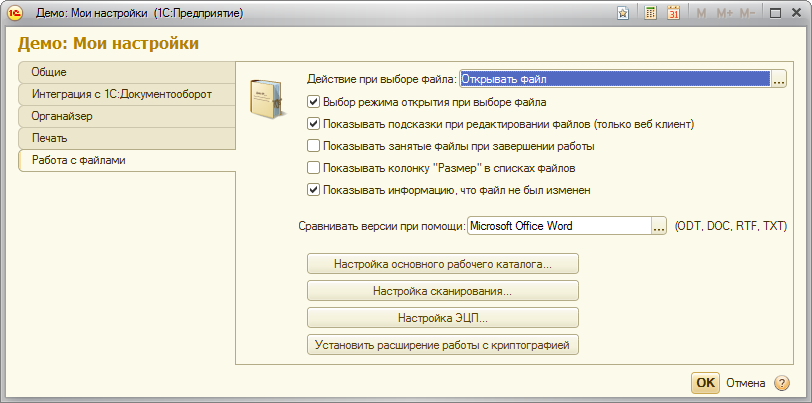

###### #std557

# Работа с пользовательскими настройками

###### 1.1.

Для хранения персональных настроек пользователя используйте `#!bsl ХранилищеОбщихНастроек`.

!!! example "Пример"

    ```bsl
    ЗначениеНастройки = ХранилищеОбщихНастроек.Загрузить("НастройкиПрограммы", "ЗадаватьВопросПриВыходе");
    ХранилищеОбщихНастроек.Сохранить("НастройкиПрограммы", "ЗадаватьВопросПриВыходе", ЗначениеНастройки);
    ```

Не храните пользовательские настройки в других объектах метаданных (регистрах, реквизитах, табличных частях), во внешних файлах и т.п.

###### 1.2.

Для работы с пользовательскими настройками у пользователя должно быть право `СохранениеДанныхПользователя`.

См. [#std488: Стандартные роли](488.md).

###### 1.3.

Для каждой настройки в хранилище общих настроек используйте уникальный строковый ключ.

!!! example "Пример"

    Для двух разных настроек пользователя используйте разные ключи:

    - `ОсновнаяОрганизация`;
    - `ОсновнойСклад`.

Допустимо объединять несколько значений в одну структуру, массив или соответствие, если они всегда читаются и сохраняются вместе.
Например, параметры прокси-сервера можно хранить как одну структуру.

###### 2.1.

В конфигурации должно быть общее место для редактирования всех пользовательских настроек.
Обычно это общая форма персональных настроек пользователя.

!!! example "Пример"

    Пример формы «Мои настройки» есть в демонстрационной конфигурации Библиотеки стандартных подсистем.

    { width="812" }

###### 2.2.

Форма персональных настроек может быть не единственным местом для редактирования.

Для удобства поля отдельных настроек можно размещать прямо в тех рабочих местах, к которым они относятся.
Например, флажок «Больше не показывать подсказки при редактировании файла» можно разместить на форме самой подсказки.

###### 2.3.

Форма персональных настроек, другие формы (рабочие места) и отдельные элементы форм для работы с персональными настройками должны быть доступны только пользователям с правом `СохранениеДанныхПользователя`.

См. [#std488: Стандартные роли](488.md).

###### 3.1.

Настройки из хранилища общих настроек не мигрируют между узлами информационной базы.
Они специфичны для конкретного узла.

При необходимости перенос настроек между узлами реализуйте отдельно средствами встроенного языка.

###### 3.2.

Все настройки в хранилище общих настроек сохраняются в разрезе пользователей по строковому имени пользователя.

Поэтому при переименовании пользователя прежние настройки теряются.
Если позже будет создан пользователь с прежним именем, он получит ранее сохраненные настройки.

Чтобы этого избежать, переносите настройки при переименовании пользователя и очищайте их при удалении пользователя.

При использовании БСП можно использовать обработчики `#!bsl ПриЗаписиПользователяИнформационнойБазы()` и `#!bsl ПослеУдаленияПользователяИнформационнойБазы()` в общем модуле `#!bsl ПользователиПереопределяемый`.

###### См. также

- [#std488: Стандартные роли](488.md)

###### Источник

https://its.1c.ru/db/v8std#content:557
