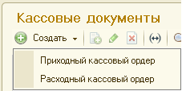

###### #std582

# Команда "Создать" в журналах документов

###### 1.

Для создания документов
в некоторых журналах
рекомендуется использовать подменю `Создать`
вместо стандартной команды `Создать`.

Вариант с подменю подходит,
если:

- в журнале отражается
  небольшое количество видов документов
  (до `6`);
- журнал часто используется в работе.

###### 2.

В подменю размещаются команды
для открытия конкретных типов документов.

###### 3.

Картинку { width="20" }
добавляйте только для подменю `Создать`.

Для каждой команды внутри подменю
использовать эту картинку не требуется.

!!! example "Пример"

    В журнале `Кассовые документы`
    доступны команды создания
    `Приходного кассового ордера`,
    `Расходного кассового ордера` и т.д.

    { width="227" }

###### 4.

В подменю `Создать`
рекомендуется сортировать команды
по частоте использования,
а не по алфавиту.

###### 5.

При использовании подменю `Создать`
поведение клавиши `Insert` не меняется:
по нажатию открывается
стандартная форма `Выбор типа документа`.

###### Источник

https://its.1c.ru/db/v8std#content:582
