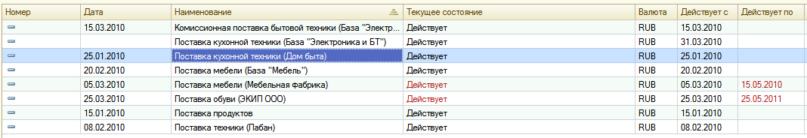

###### #std584

# Акцентирование внимания на просроченных или критичных состояниях

Если нужно привлечь внимание
к истекающему состоянию,
сроку выполнения операции
или другой критичной ситуации,
рекомендуется выделять только тот элемент,
который помогает понять:

- в чем причина привлечения внимания;
- что нужно сделать дальше.

Цвет текста:
`ПросроченныеДанные` (`RGB 178, 34, 34`).

!!! example "Пример"

    Если истекает срок действия соглашения с поставщиком,
    выделяются только ячейки состояния `действует`
    и `действует по`.

    { width="1068" }

###### Источник

https://its.1c.ru/db/v8std#content:584
