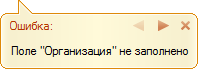
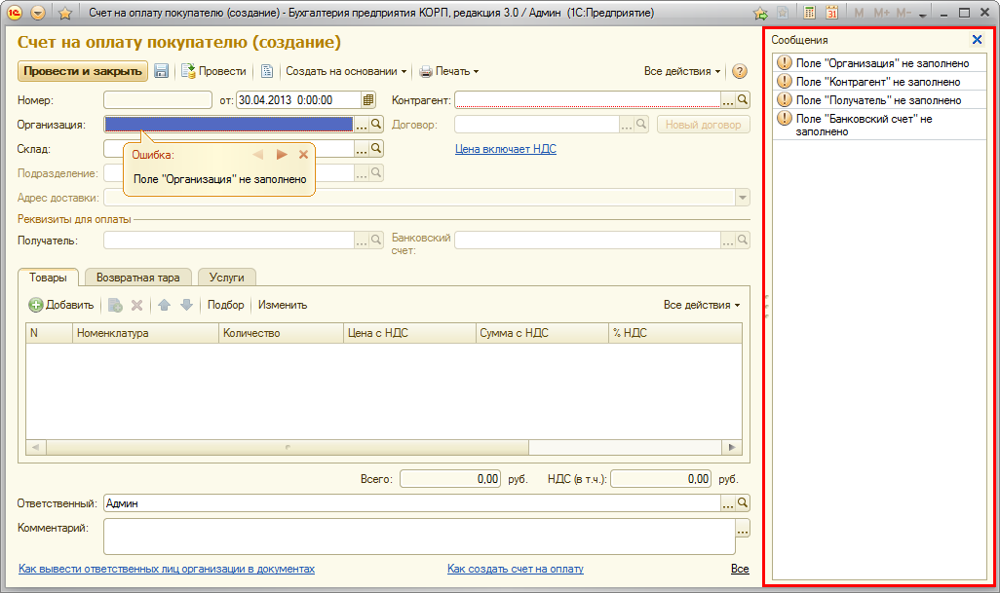
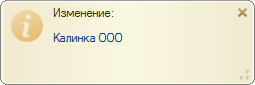
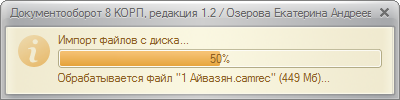
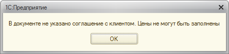
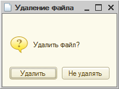
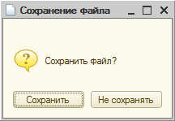

###### #std585

# Сообщения пользователю

###### 1.

Общие рекомендации.

###### 1.1.

Сообщения должны быть информативными и содержательными.
Используйте безличные формулировки.
Не употребляйте местоимения `Вы`, `Вас` и т.п.

!!! success "Правильно"

    "Недостаточно прав для выполнения обработки"

!!! failure "Неправильно"

    "У Вас недостаточно прав для выполнения обработки"

###### 1.2.

Не используйте восклицательные знаки и повелительный тон,
кроме сообщений о действительно опасных или критических действиях.

!!! success "Правильно"

    - "Внимание. Загрузка базы может привести к потере всех данных"
    - "Выберите элемент, а не группу"

!!! failure "Неправильно"

    - "Внимание! Загрузка базы может привести к потере всех данных"
    - "Выберите элемент, а не группу!"

    Такие формулировки задают лишний эмоциональный тон и снижают качество коммуникации.

###### 1.3.

Пишите сообщение текстом, понятным пользователю.
Не используйте техническую терминологию разработчика,
если сообщение не предназначено администратору.

!!! success "Правильно"

    "Касса отправителя и касса получателя должны различаться"

!!! failure "Неправильно"

    "Касса отправителя равна кассе получателя"

###### 1.4.

Сообщения об ошибках выводите в момент возникновения ошибки.

Например, если регистрационный номер сотрудника используется в отчете,
проверку корректности номера выполняйте при вводе в карточке сотрудника,
а не при формировании отчета.

###### 1.5.

Избегайте двусмысленных вопросов.
Не используйте вопросы с частицами `не` и `бы`.

!!! success "Правильно"

    "Удалить файл?"

!!! failure "Неправильно"

    - "Не хотели бы вы удалить этот файл?" (`Да`/`Нет`)
    - "Переместить или удалить этот файл?" (`Да`/`Нет`)

###### 1.6.

Не используйте сокращения и аббревиатуры,
кроме общеупотребительных и понятных целевой аудитории.

Например, `НДС` и `МСФО` обычно понятны пользователям,
а `К.` (коэффициент) — нет.

###### 1.7.

Если текст сообщения занимает несколько строк,
делайте переносы на логической паузе или после знака препинания.

!!! success "Правильно"

    ```text
    Не рекомендуется изменять значение ставки налога,
    если она уже используется в справочниках или документах.
    ```

!!! failure "Неправильно"

    ```text
    Не рекомендуется изменять значение ставки налога, если
    она уже используется в справочниках или документах.
    ```

###### 1.8.

В процедурах и функциях, выполняемых в транзакции,
не взаимодействуйте с пользователем:

- не выводите предупреждения;
- не задавайте вопросы.

###### 1.9.

Сообщения, оповещения, предупреждения и состояние
не используйте для вывода протоколов, отчетов и детальных результатов операции.

Для этого предусмотрите отдельную форму.

###### 2.

Сообщение об ошибках в форме.

!!! example "Панель сообщений об ошибках"

    { width="198" }
    { width="900" }

###### 2.1.

В панели сообщений выводите только ошибки.
Сообщения об успешном завершении операций в этой панели не выводите.

###### 2.2.

По возможности привязывайте сообщение к полю,
которое вызвало ошибку или позволяет ее исправить.

Если привязка к полю невозможна,
в тексте сообщения явно указывайте, что нужно сделать пользователю.

###### 2.3.

Сообщение об ошибке должно отвечать на три вопроса:

- что произошло;
- почему произошло;
- что делать дальше.

Ответов должно хватать,
чтобы пользователь принял решение и не повторял ошибку в будущем.

!!! success "Правильно"

    "Невозможно изменить статус: документ \"Коммерческое предложение <номер>\" помечен на удаление"

!!! failure "Неправильно"

    "Документ \"Коммерческое предложение <номер>\" не проведен. Статус не изменен"

###### 2.4.

В панели сообщений текст форматируется автоматически,
строки переносятся с сохранением пропорций.

Не добавляйте принудительные переносы строк в текст ошибки.

См. также: [#std444: Перенос выражений](444.md).

###### 2.5.

Сообщение делайте кратким и понятным.

Если поле заполнено, но заполнено неверно,
сообщение должно быть более подробным.

Пример: `Указанного количества товара <название товара> нет на складе. Доступно: <количество доступно> <единица измерения>`.

###### 2.6.

Текст сообщения об ошибке должен содержать побудительную часть,
которая подсказывает действие для исправления ошибки.

!!! success "Правильно"

    "Укажите хотя бы одну систему налогообложения"

!!! failure "Неправильно"

    "Необходимо указать хотя бы одну систему налогообложения"

###### 3.

Оповещение.

!!! example "Пример оповещения"

    { width="255" }

###### 3.1.

Используйте оповещение для информирования без прерывания основной работы.

Пользователю не обязательно реагировать на оповещение.
Оповещение сообщает, что операция выполнена
(например, запись элемента справочника или проведение документа).

###### 3.2.

Делайте оповещения с гиперссылками на соответствующие объекты.

###### 3.3.

Текст и пояснение оповещения составляйте так,
чтобы они полностью помещались в окно оповещения с размерами по умолчанию:

- текст — до `36` знаков;
- пояснение — около `100` знаков (обычно до трех строк).

###### 4.

Состояние.

###### 4.1.

Используйте состояние для длительных процессов
(обычно более `10` секунд),
чтобы у пользователя не возникало ощущения, что программа «зависла».

Выводите состояние:

- перед началом выполнения (`Выполняется расчет. Пожалуйста, подождите…`);
- в процессе выполнения (если возможно);
- при завершении (`Расчет выполнен`).

###### 4.2.

Состояние применяйте для длительных операций,
которые состоят из последовательности более мелких действий.

!!! example "Пример состояния по шагам"

    { width="400" }

###### См. также

- [#std642: Длительные операции](642.md)
- [Запись событий в историю работы пользователя](https://its.1c.ru/db/v8std#content:497)

###### 5.

Предупреждение.

###### 5.1.

Предупреждение используйте только когда нужно прервать работу пользователя,
чтобы он ознакомился с информацией.

Для продолжения работы пользователь не должен принимать решение.

###### 5.2.

Не используйте предупреждение для сообщения о начале длительной обработки.
Такое сообщение показывайте в форме самой обработки.

###### 5.3.

Текст предупреждения должен содержать завершенное пояснение
о последующих действиях и их последствиях.

!!! example "Пример предупреждения"

    { width="451" }

###### 6.

Вопросы в сообщениях.

###### 6.1.

Используйте вопросы,
когда пользователь должен принять решение,
например о продолжении начатой операции.

###### 6.2.

Вопросы задавайте перед выполнением:

- действий, результат которых нельзя отменить;
- потенциально опасных для данных пользователя действий;
- массовой обработки информационной базы;
- длительных процедур.

###### 6.3.

Ответы в вопросе формулируйте глаголами,
которые обозначают последующие действия.

!!! example "Пример"

    { width="200" }

###### 6.4.

В вопросах кнопкой по умолчанию делайте вариант,
который наиболее безопасен для данных пользователя.

!!! example "Пример безопасной кнопки по умолчанию"

    { width="216" }

!!! tip "Важно"

    В `Windows` кнопкой по умолчанию чаще всего является первая (левая) кнопка.
    Меняйте кнопку по умолчанию только в исключительных ситуациях.

###### См. также

- [#std400: Информирование пользователя](400.md)
- [#std444: Перенос выражений](444.md)
- [#std642: Длительные операции на сервере](642.md)

###### Источник

https://its.1c.ru/db/v8std#content:585
