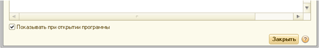

###### #std586

# Окно старта

Если содержание окна на старте
не обязательно для ознакомления пользователем,
предусмотрите по умолчанию установленный флажок
`Показывать при открытии программы`.

Флажок рекомендуется располагать
под содержанием окна.

{ width="645" }

###### Источник

https://its.1c.ru/db/v8std#content:586
