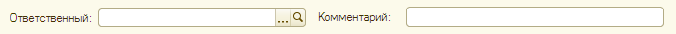
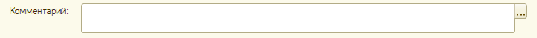
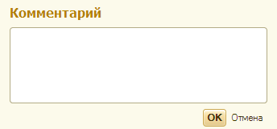
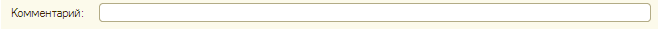
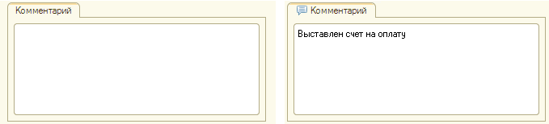

###### #std587

# Поля "Ответственный" и "Комментарий"

Поля `Ответственный` и `Комментарий`
в формах документов
нужно располагать и оформлять
по единым правилам.

###### 1. 

Расположение группы полей "Ответственный" и "Комментарий"

Группу полей `Ответственный` и `Комментарий`
следует располагать в самом низу формы,
друг за другом.

{ width="676" }

###### 2. 

Оформление поля "Ответственный"

- Поле не растягивается на всю ширину формы.
- Ширину поля подбирают так,
  чтобы в него полностью помещались
  типичные значения.
  На максимально возможные значения
  ориентироваться не нужно.

{ width="306" }

###### 3. 

Оформление поля "Комментарий"

- Заголовок располагается слева от поля.
- Поле растягивается по горизонтали
  на всю ширину формы.
- Поле не растягивается по вертикали.

Как правило,
поле `Комментарий` многострочное
(`МногострочныйРежим = Да`).

Если в поле обычно вводится
небольшой объем информации,
его рекомендуется делать однострочным
(`МногострочныйРежим = Авто`).

Решение о выборе режима
принимается разработчиком
по прикладным требованиям.

###### 3.1. 

Оформление многострочного поля "Комментарий"

{ width="664" }

- Высота поля: две строки.
- Используется кнопка выбора,
  по которой открывается
  блокирующее окно
  редактора многострочного текста.

{ width="344" }

###### 3.2. 

Оформление однострочного поля "Комментарий"

{ width="658" }

- Высота поля: одна строка.
- Кнопка выбора не используется.

Если поле `Комментарий`
в типовых сценариях большое,
допускается вынести его на отдельную вкладку.

###### 4. 

Оформление вкладки "Комментарий"

- Заголовок вкладки: `Комментарий`.
- На вкладке размещается поле комментария,
  которое растягивается
  по горизонтали и вертикали.
  Заголовок самого поля не отображается.
- Если поле комментария заполнено,
  в заголовке вкладки
  отображается картинка `Комментарий`.

{ width="679" }

###### См. также

- [#std719: Поля "Ответственный" и "Комментарий" (8.3)](719.md)
- [#std531: Реквизит "Комментарий" у документов](531.md)

###### Источник

https://its.1c.ru/db/v8std#content:587
