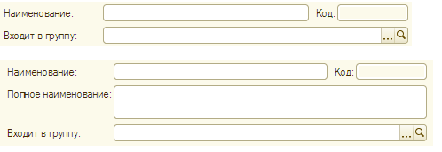

###### #std588

# Группа полей "Наименование", "Код", "Полное наименование", "Входит в группу"

Поля,
содержащие наименование объекта
(одно или несколько),
код и группу,
в которую входит объект,
рекомендуется объединять вместе.

В качестве заголовка группы
рекомендуется использовать понятный заголовок,
например `Входит в группу`.

Заголовки остальных полей
не следует менять без крайней необходимости,
чтобы они соответствовали синонимам
реквизитов объектов метаданных.

Расположение полей:

- группа полей размещается в верхней части формы;
- первыми располагаются поля
  `Наименование` и `Код`:
  горизонтально в одну строку,
  поле `Код` следует за полем `Наименование`;
- при наличии поля `Полное наименование`
  оно размещается под полями
  `Наименование` и `Код`;
- поле `Входит в группу`
  рекомендуется располагать последним.

Рекомендуется пропускать поле `Код`
при вводе с клавиатуры.

!!! example "Пример"

    Примеры расположения полей:

    { width="498" }

###### Источник

https://its.1c.ru/db/v8std#content:588
