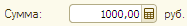
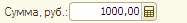
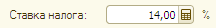
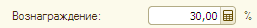
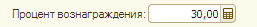
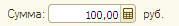
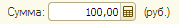
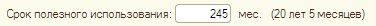
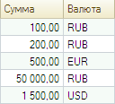
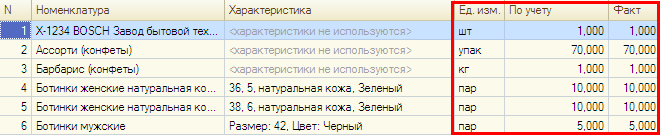

###### #std593

# Единицы измерения

###### Для полей ввода

###### 1.1.

Единицы измерения
следует указывать после поля,
а не в заголовке.

!!! success "Хорошо"

    { width="187" }

!!! failure "Плохо"

    { width="187" }

!!! success "Хорошо"

    { width="216" }

!!! failure "Плохо"

    { width="216" }

!!! success "Хорошо"

    { width="257" }

!!! failure "Плохо"

    { width="257" }

###### 1.2.

Единицы измерения
следует указывать без скобок.

!!! success "Хорошо"

    { width="179" }

!!! failure "Плохо"

    { width="179" }

###### 1.3.

Если к единице измерения
нужно выводить расшифровку,
ее следует располагать в скобках
после единицы измерения.

Например,
для срока полезного использования:

!!! example "Пример"

    { width="376" }

###### Для списков

###### 2.1.

Единицу измерения
следует выводить в колонке
с названием `Ед. изм.`.

!!! success "Хорошо"

    | Количество | Ед. изм. |
    | ---: | --- |
    | 100,000 | кг |
    | 5,000 | шт |

!!! failure "Плохо"

    | Количество | Ед |
    | ---: | --- |
    | 100,000 | кг |
    | 5,000 | шт |

!!! success "Хорошо"

    | Количество | Ед. изм. |
    | ---: | --- |
    | 100,000 | кг |
    | 5,000 | шт |

!!! failure "Плохо"

    | Количество | Единица измерения |
    | ---: | --- |
    | 100,000 | кг |
    | 5,000 | шт |

Исключение:
денежные единицы измерения
выводятся в колонке `Валюта`.

!!! example "Пример"

    { width="128" }

###### 2.2.

Если единица измерения
для всех значений одинакова,
ее следует выводить
в заголовке колонки.

!!! success "Хорошо"

    | Сумма, руб. |
    | ---: |
    | 20 000,00 |
    | 5 000,00 |
    | 100,00 |
    | 1 000,00 |

!!! failure "Плохо"

    | Сумма |
    | ---: |
    | 20 000,00 руб. |
    | 5 000,00 руб. |
    | 100,00 руб. |
    | 1 000,00 руб. |

!!! success "Хорошо"

    | Размер, кб. |
    | ---: |
    | 41 |
    | 75 |
    | 34 |
    | 28 |

!!! failure "Плохо"

    | Размер |
    | ---: |
    | 41 кб. |
    | 75 кб. |
    | 34 кб. |
    | 28 кб. |

###### 2.3.

Если единица измерения
для разных строк отличается,
ее можно выводить:

- либо в отдельной колонке;
- либо в колонке с количеством/суммой,
  сразу после значения.

Во всех случаях
единицу измерения
следует выводить непосредственно
после измеряемого значения.

!!! success "Хорошо"

    | Наименование | Количество | Ед. изм. |
    | --- | ---: | --- |
    | Папка-вкладыш А4 | 100,000 | шт |
    | Клей канцелярский | 5,000 | кг |

!!! failure "Плохо"

    | Наименование | Ед. изм. | Количество |
    | --- | --- | ---: |
    | Папка-вкладыш А4 | шт | 100,000 |
    | Клей канцелярский | кг | 5,000 |

!!! success "Хорошо"

    | Наименование | Количество |
    | --- | ---: |
    | Папка-вкладыш А4 | 100,000 шт |
    | Клей канцелярский | 5,000 кг |

!!! failure "Плохо"

    | Наименование | Количество |
    | --- | ---: |
    | Папка-вкладыш А4, шт | 100,000 |
    | Клей канцелярский, кг | 5,000 |

Исключение:
если одна единица измерения
относится сразу к нескольким колонкам,
ее следует располагать
до этих колонок.

Например,
в документе `Пересчет товаров`
две колонки количества
(`по учету` и `по факту`).

!!! example "Пример"

    { width="660" }

###### Источник

https://its.1c.ru/db/v8std#content:593
