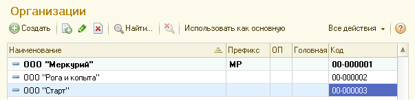
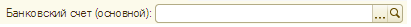
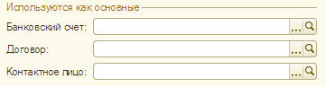

###### #std594

# Значения по умолчанию

Рекомендуется явно выделять
среди остальных значения,
которые используются
для подстановки в поля по умолчанию.

Для обозначения таких значений
лучше использовать термин `основной`.

## Выделение в списках

- Для выбора в списке
  основного элемента
  рекомендуется использовать
  отдельную команду,
  расположенную
  в командной панели списка.
- Название команды
  выбирается в зависимости
  от заголовка формы:
  `Использовать как основной`,
  `Использовать как основную`,
  `Использовать как основное`.

Например,
для формы `Организация`
команда будет называться
`Использовать как основную`.

- Для элемента,
  выбранного основным,
  используется шрифт
  `ОсновнойЭлементСписка`
  (шрифт диалогов и меню,
  начертание `жирный`).

!!! example "Пример"

    { width="603" }

## Выделение в форме

- Если в форме одно поле,
  используемое для заполнения по умолчанию,
  рекомендуется после его заголовка
  добавлять слово `основной`
  (`основная`, `основное`)
  в круглых скобках.

!!! example "Пример"

    { width="411" }

- Если в форме несколько полей,
  используемых для заполнения по умолчанию,
  их следует оформлять
  в виде группы
  с заголовком `Используются как основные`.
  В заголовки отдельных полей
  слово `основной`
  добавлять не рекомендуется.

!!! example "Пример"

    { width="361" }

Если создается и заполняется форма,
имеющая подчиненные формы,
то при заполнении полей
со значениями по умолчанию
рекомендуется записывать данные автоматически,
без выдачи сообщений пользователю.

###### Источник

https://its.1c.ru/db/v8std#content:594
