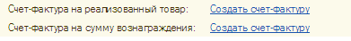

###### #std595

# Гиперссылка на счет-фактуру

_Область применения: управляемое приложение._

Если в форме документа
есть гиперссылка на счет-фактуру,
рекомендуется оформлять ее так:

- размещать в нижней части формы,
  до группы полей
  `Ответственный` и `Комментарий`;
- располагать в отдельной строке
  с выравниванием по левому краю формы;
- перед ссылкой выводить подпись
  `Счет-фактура`.
  Допускается уточнять тип счета-фактуры
  (например,
  `Счет-фактура выставленный`,
  `Счет-фактура полученный`,
  `Счет-фактура на сумму вознаграждения`);
- размещать гиперссылку
  на всю ширину формы.
  Если подвал многоколоночный
  и поле счета-фактуры
  относится к отдельной колонке,
  ширина поля должна соответствовать
  ширине этой колонки;
- при наличии нескольких гиперссылок
  на счета-фактуры
  размещать их друг под другом.

!!! example "Пример"

    { width="398" }

## Оформление текста гиперссылки

- Если счет-фактура не указан,
  рекомендуется выводить текст
  `Создать счет-фактуру`.

!!! example "Пример"

    { width="494" }

- Если счет-фактура указан,
  выводятся его номер и дата.

!!! example "Пример"

    { width="495" }

- Если ввод счета-фактуры не требуется,
  рекомендуется выводить текст
  `Не требуется`.

!!! example "Пример"

    { width="498" }

- Если для создания нового счета-фактуры
  нужно записать текущий объект,
  рекомендуется по возможности
  не выводить сообщение вида
  `Документ не записан. Записать?`,
  а записывать объект автоматически.

Если у пользователя
нет права на создание счета-фактуры,
но есть право на ее чтение,
рекомендуется:

- вместо гиперссылки
  выводить надпись
  `<Недостаточно прав для создания счета-фактуры>`;
- использовать цвет
  `ПояснениеОтсутствующейГиперссылки`
  (`128,128,128`).

!!! example "Пример"

    { width="345" }

###### Источник

https://its.1c.ru/db/v8std#content:595
