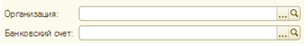
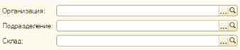
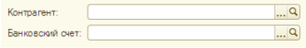
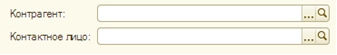

###### #std597

# Компоновка форм

!!! warning "Устаревший стандарт"
    Этот стандарт устарел. Используйте [#std722: Компоновка форм (8.3)](722.md).

###### См. также

- [#std722: Компоновка форм (8.3)](722.md)

###### 1.

Общие рекомендации

###### 1.1.

Один и тот же реквизит
в разных формах
рекомендуется размещать в одинаковом месте.

!!! example "Пример"

    Поле `Контрагент`
    располагается в левой верхней части
    всех форм,
    где оно присутствует.

###### 1.2.

В шапке формы документа
размещайте реквизиты,
которые нужны для корректной регистрации документа в программе.

Сведения,
относящиеся к содержательной части документа,
итоговые и второстепенные реквизиты
в шапке указывать не следует.

###### 1.3.

Шапка документа
может состоять из одной,
двух
или трех колонок.

Число и состав колонок
определяются количеством реквизитов документа.

###### 2. 

Оформление шапки, состоящей из двух колонок

###### 2.1.

В левой колонке
рекомендуется размещать основные сведения о документе,
в правой - второстепенные.

| Левая колонка | Правая колонка |
| --- | --- |
| Важные для заполнения поля | Вспомогательные, малозначительные поля |
| Поля, заполняемые пользователем | Поля, заполняемые автоматически, значение которых требуется только проконтролировать |
| Обязательные для заполнения поля | Не обязательные для заполнения поля |
| Поля, значения которых заполняются по данным, приходящим извне | Поля, значения которых пользователь устанавливает самостоятельно по внутренним данным |

###### 2.2.

Реквизиты рекомендуется распределять
по колонкам в следующем порядке.

| Левая колонка | Правая колонка |
| --- | --- |
| `Номер, дата` `Вид операции` `Контрагент` `Банковский счет (контрагента)` `Договор` `Контактное лицо` | `Организация` `Банковский счет (организации)` `Подразделение` `Склад` `Касса` `Регистрация в ИФНС` |

###### 2.3.

Если в форме есть несколько взаимозависимых полей,
их следует располагать последовательно:
одно под другим.

!!! example "Пример"

    Поле `Подразделение`
    располагается сразу под полем `Организация`.

###### 2.4.

Если в форме есть поле `Вид операции`,
под ним следует размещать реквизиты,
состав которых зависит от выбранного вида операции.

Исключение:
реквизиты,
которые относятся к содержательной части формы.

###### 3. 

Примеры оформления конкретных групп полей

| Левая колонка | Правая колонка |
| --- | --- |
| `Номер, дата + Вид операции` { width="350" } | `Организация + Банковский счет (организации)` { width="340" } |
| `Контрагент + Договор` { width="342" } | `Организация + Подразделение + Склад` { width="338" } |
| `Контрагент + Банковский счет (контрагента)` { width="346" } | `Организация + Подразделение` { width="339" } |
| `Контрагент + Контактное лицо` { width="337" } | `Организация + Касса` { width="329" } |
|  | `Организация + Регистрация в ИФНС` { width="339" } |

###### Источник

https://its.1c.ru/db/v8std#content:597
