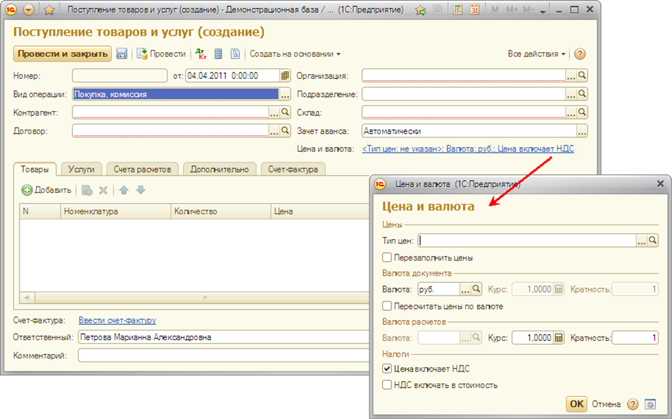
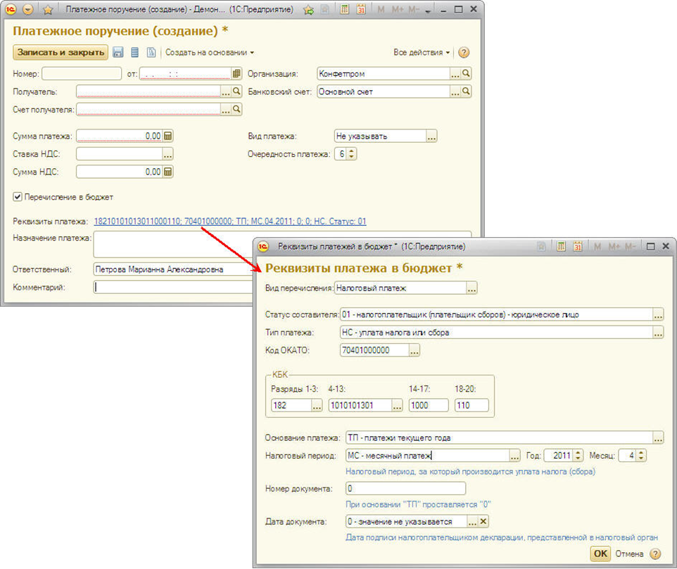
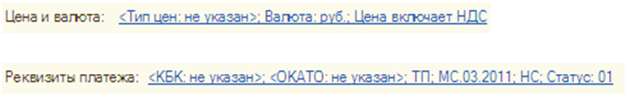

###### #std602

# Переход к форме с дополнительными реквизитами

Для перехода к форме,
в которую вынесена часть реквизитов
из основной формы,
рекомендуется использовать гиперссылку.

!!! example "Пример"

    Гиперссылка для перехода:

    - к форме `Цена и валюта`
      из формы `Поступление товаров и услуг`;
    - к форме `Реквизиты платежа в бюджет`
      из формы `Платежное поручение`.

    { width="965" }
    { width="962" }

Перед гиперссылкой
выводится подпись,
где указывается заголовок
открываемой формы.

Текст гиперссылки
должен информировать пользователя,
какие реквизиты можно заполнить
в открываемой форме.

!!! example "Пример"

    { width="788" }

## Что указывается в тексте гиперссылки

- реквизиты,
  которые чаще всего заполняются
  в открываемой форме;
- реквизиты,
  значения которых влияют
  на порядок заполнения основной формы;
- реквизиты,
  для которых установлена обязательность заполнения.

## Как оформляется текст гиперссылки

- реквизиты перечисляются через точку с запятой
  и разделяются пробелом;
- сначала выводится заголовок реквизита,
  затем через двоеточие его значение;
  значение можно указывать и без заголовка,
  если смысл понятен из контекста
  (например, `НС` вместо `Тип платежа: НС`);
- если значение реквизита не заполнено,
  выводится текст `не указан`,
  а заголовок и текст
  показываются в угловых скобках
  (например, `<Тип цен: не указан>`,
  `<КБК: не указан>`);
- для реквизита-флажка
  выводится его заголовок,
  если флаг установлен,
  и заголовок с частицей `не`,
  если флаг не установлен
  (например, `Цена включает НДС`
  и `Цена не включает НДС`).

###### См. также

- [#std722: Компоновка форм (8.3)](722.md)
- [#std599: Выбор: кнопка или гиперссылка](599.md)

###### Источник

https://its.1c.ru/db/v8std#content:602
