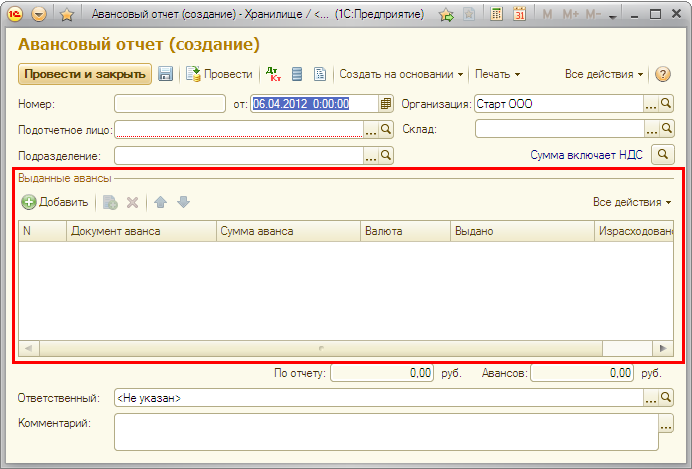
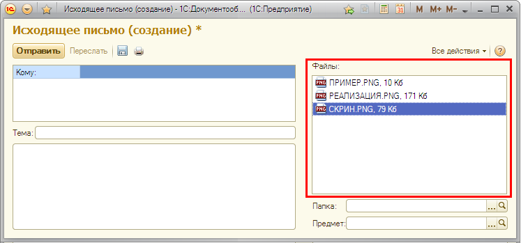
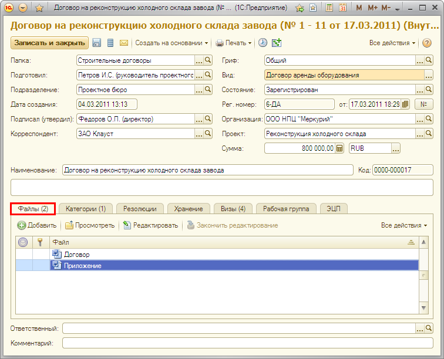
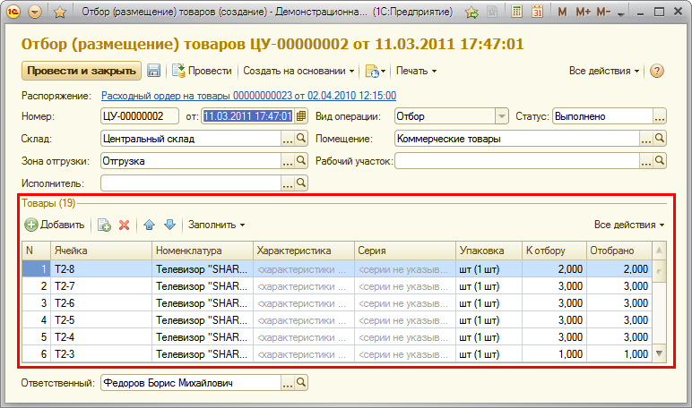
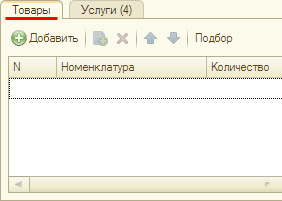
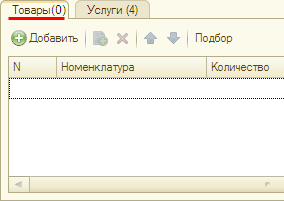
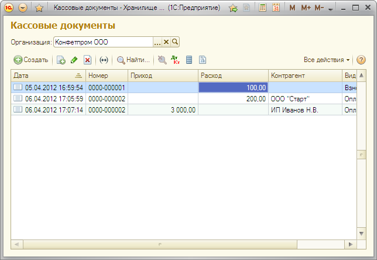
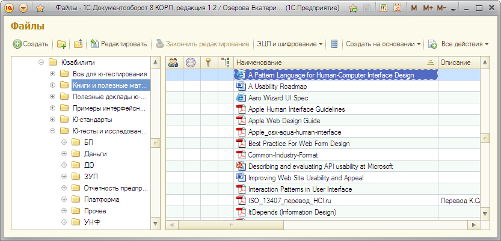
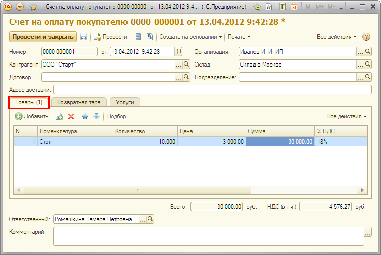

###### #std607

# Заголовки списков

###### 1. 

Оформление заголовка списка

###### 1.1.

Если список имеет командную панель,
его заголовок выводится в виде группы
с рамкой `Линия`.

!!! example "Пример"

    Список `Выданные авансы`.

    { width="692" }

###### 1.2.

Если список не имеет командной панели,
его заголовок выводится в положении `Верх`.

!!! example "Пример"

    Список `Файлы` в карточке письма.

    { width="747" }

###### 2. 

Отражение количества элементов в списке

###### 2.1.

Количество элементов выводите только тогда,
когда это уместно
и помогает пользователю решать задачу.

!!! example "Пример"

    В карточке внутреннего документа
    количество в заголовке списка файлов показывает,
    с каким числом файлов нужно ознакомиться пользователю.

    { width="756" }

###### 2.2.

Если для конкретного списка принято выводить
количество элементов,
это нужно делать во всех формах программы,
где этот список используется
и решает аналогичные задачи.

!!! example "Пример"

    Количество в заголовке списка файлов
    выводится во всех видах документов:
    входящих,
    исходящих,
    внутренних.

###### 2.3.

Количество элементов в списке
выводится после заголовка,
в круглых скобках.

!!! example "Пример"

    Число товаров в списке `Товары`
    документа `Отбор (размещение) товаров`.

    { width="772" }

###### 2.4.

В пустом списке
количество элементов выводить не требуется.

!!! success "Хорошо"

    { width="282" }

!!! failure "Плохо"

    { width="284" }

###### 3. 

Ситуации, в которых заголовок списка не выводится

###### 3.1.

Если на форме только один список,
в качестве заголовка выступает название формы.

!!! example "Пример"

    Журнал `Кассовые документы`.

    { width="644" }

###### 3.2.

Если на форме два списка,
связанных общим контекстом,
и назначение списков интуитивно понятно
без дополнительного пояснения,
в качестве общего заголовка
используется название формы.

!!! example "Пример"

    Дерево папок файлов
    и список файлов в папке.

    { width="833" }

###### 3.3.

Если список выводится на странице (вкладке),
в качестве заголовка
выступает название страницы (вкладки).

!!! example "Пример"

    Вкладка `Товары`
    в документе `Счет на оплату покупателю`.

    { width="756" }

В остальных случаях
заголовок списка рекомендуется показывать.

###### Источник

https://its.1c.ru/db/v8std#content:607
