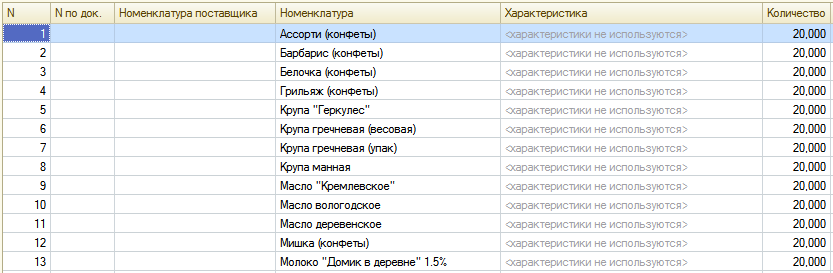

###### #std610

# Пояснение невозможности заполнения ячеек в табличных частях

Если ячейка табличной части
в конкретном состоянии не должна заполняться,
пользователю нужно явно сообщить причину.

Текст такого сообщения
рекомендуется оформлять так:

- в угловых скобках;
- цветом `ТекстЗапрещеннойЯчейки`
  (`RGB: 192,192,192` );
- со строчной буквы.

!!! example "Пример"

    Если номенклатура
    не использует характеристики,
    в ячейке `Характеристика`
    выводится текст:
    `<характеристики не используются>`.

    { width="833" }

###### Источник

https://its.1c.ru/db/v8std#content:610
