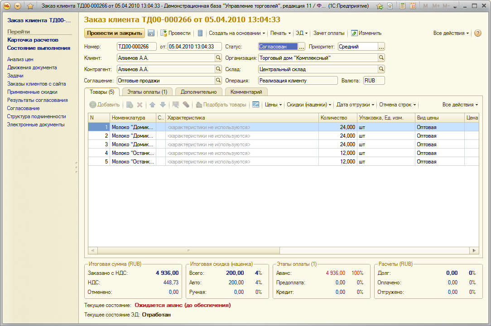
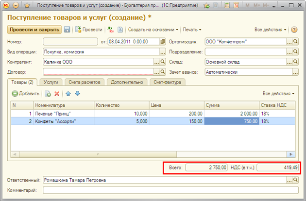
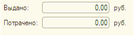
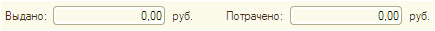

###### #std613

# Итоги в документах

Итоги в документах
можно размещать:

- в подвале колонок таблиц;
- отдельными полями после таблиц;
- в специальной области итогов
  в нижней части формы документа.

Итоги в подвалах таблиц
рекомендуется использовать,
если одновременно выполняются условия:

- в таблице нет горизонтальной прокрутки,
  итоговая колонка всегда видна;
- итог визуально связан
  с конкретной колонкой таблицы.

В остальных случаях
лучше размещать итоговые данные
в специальной области итогов
в нижней части формы документа.

В области итогов
не рекомендуется размещать элементы,
не относящиеся к итоговым данным.
Их следует располагать
до или после области итогов.

Например,
ссылку на счет-фактуру
следует размещать
до области итогов,
а группу полей
`Ответственный` и `Комментарий`
после нее.

Для оформления области итогов
можно использовать следующие способы.

!!! example "Пример"

    Объединение итоговых показателей в группы.
    В этом варианте поля итогов рекомендуется оформлять как надписи.

    { width="903" }

!!! example "Пример"

    Вывод итоговых показателей в отдельных полях ввода.

    { width="630" }

При выборе способа оформления
следует руководствоваться
следующими критериями:

| Объединение в группы | Отдельные поля ввода |
| --- | --- |
| Возможность копирования итоговых сумм не требуется | Нужно дать возможность копирования итоговых сумм в буфер обмена |
| Итоговых показателей много (например, три и более) | Итоговых показателей немного (например, один или два) |

В итоговых показателях,
размещаемых в нижней части формы,
отражается сводная информация
по содержанию документа.

Если в итоговых показателях
выводится информация
по конкретной таблице,
рекомендуется размещать итоги
сразу под этой таблицей,
оформляя их в виде полей ввода.

## Оформление итогов в группах

Итоговая информация
это информация,
необходимая для понимания документа
и принятия решения
о дальнейшем действии.

Набор итоговой информации
определяется для каждого документа отдельно.

!!! example "Примеры итоговой информации"

    `Итоговая сумма`,
    `Сумма с НДС`,
    `Сумма без НДС`,
    `Итоговая скидка`
    (автоматическая, ручная).

Итоговая информация
в нижней части формы документа:

- оформляется в виде групп
  с рамками и заголовком;
- если в группе объединены данные
  с одинаковой валютой
  или единицей измерения,
  название единицы/валюты
  выносится в заголовок группы,
  а не повторяется у каждого поля;
- должна обновляться
  при изменении содержимого документа,
  а не только при записи или проведении;
- желательно снабжать итоговые показатели
  подсказками,
  поясняющими происхождение цифр;
- для положительной, нейтральной,
  непросроченной информации
  рекомендуется цвет
  `ИтоговыеПоказателиДокументов`
  (`RGB: 22,39,121` );
- для негативной, просроченной информации
  рекомендуется цвет
  `ПросроченныеДанные`
  (`RGB: 178,34,34` );
- если в группе есть
  основное итоговое значение,
  для него следует использовать шрифт
  `ОсновноеИтоговоеЗначение`
  (шрифт диалогов и меню,
  начертание `жирный`).

Например:
`Сумма с НДС`,
`Итоговый размер скидки`.

## Оформление итогов отдельными полями ввода

- Итоги оформляются отдельными полями ввода
  с признаком `Только чтение`.
- Поля выравниваются
  по правому краю формы.
- В заголовках полей
  не используется слово `итог`.
  Валюту (если нужно)
  следует указывать после поля ввода.

Если итогов несколько,
их можно размещать
в одну или несколько строк.
Выбор варианта зависит
от компоновки формы.

!!! example "Пример"

    Поля, значения которых зависят друг от друга (например,
    `Всего` и `НДС (в т.ч.)`), рекомендуется размещать в одной строке.

    { width="425" }

!!! example "Пример"

    Поля, значения которых нужно сравнивать, лучше размещать друг под другом.

    { width="223" }

!!! example "Пример"

    Если размер формы не позволяет такой компоновки, поля можно располагать в одну строку.

    { width="435" }

###### См. также

- [#std718: Итоги в документах (8.3)](718.md)

###### Источник

https://its.1c.ru/db/v8std#content:613
