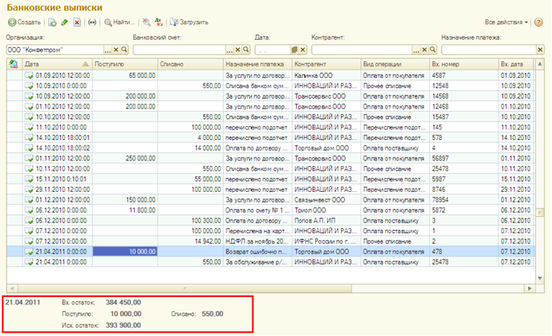

###### #std614

# Итоги в журналах документов

Итоги в журналах документов
(если они предусмотрены)
рекомендуется оформлять так:

- размещать в нижней части формы,
  слева;
- поля итогов оформлять как надписи;
- для выделения значений
  использовать цвет `ИтогиЖурналаЦвет`
  (`RGB 100,100,100`)
  и шрифт `ИтогиЖурналаШрифт`
  (шрифт диалогов и меню,
  начертание `жирный`).

Например,
в журнале `Банковские выписки`
в качестве итогов
оформлены поля,
отражающие остатки и обороты
по расчетному счету за день.

!!! example "Пример"

    { width="680" }

###### Источник

https://its.1c.ru/db/v8std#content:614
