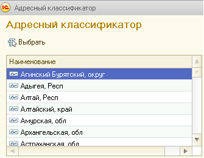
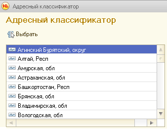

###### #std617

# Списки с одной колонкой

- Не рекомендуется делать шапку.
- Если заголовка нет,
  визуально пустой список
  не отличается от многострочного поля ввода.
  Это нужно учитывать,
  чтобы не вводить пользователя в заблуждение.
- Не рекомендуется использовать
  горизонтальную разлиновку
  и чередование строк.

!!! failure "Неправильно"

    { width="335" }

!!! success "Правильно"

    { width="338" }

###### Источник

https://its.1c.ru/db/v8std#content:617
