###### #std622

# Флажки

Флажки используйте
для реквизитов типа `Булево`.

Подписи к флажкам
оформляйте по правилам ниже.

###### 1.

Подпись располагайте
справа от флажка.

!!! success "Правильно"

    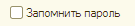{ width="135" }

!!! failure "Неправильно"

    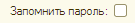{ width="135" }

###### 2.

Если для флажка нужна подсказка,
ее располагайте
либо снизу,
либо справа от подписи.

!!! success "Правильно"

    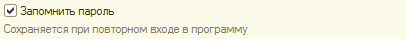{ width="407" }
    { width="407" }

!!! failure "Неправильно"

    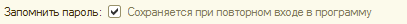{ width="407" }

###### 3.

Первая буква подписи флажка
должна быть заглавной.

!!! success "Правильно"

    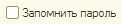{ width="122" }

!!! failure "Неправильно"

    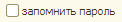{ width="122" }

###### 4.

Подписи у флажков
делайте позитивными
(без отрицания).

!!! success "Правильно"

    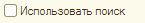{ width="145" }

!!! failure "Неправильно"

    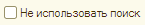{ width="145" }

Если при этом требуется,
чтобы флажок по умолчанию
был установлен,
у реквизита объекта метаданных
следует установить свойство
`Значение заполнения`
в значение `#!bsl Истина`.

Подпись с отрицанием
следует применять
только в исключительных случаях,
когда это выглядит естественно
или обусловлено историческими причинами.

Например:
`Не показывать это окно`,
`Больше не спрашивать`,
`Недействительный`
(для учета неактуальных пользователей).

###### 5.

Текст подписи
должен быть понятным и кратким.

Не следует делать подпись,
состоящую из двух и более предложений.

###### 6.

Подпись к флажку
определяет только один вариант,
второй остается неявным.

Поэтому текст подписи
следует подбирать так,
чтобы у пользователей
не возникало сомнений,
каким будет второй вариант.

!!! success "Правильно"

    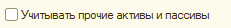{ width="231" }

!!! failure "Неправильно"

    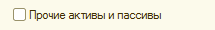{ width="215" }

Если такую подпись
подобрать не удается,
лучше использовать радиокнопки,
у которых явным образом
заданы названия вариантов.

!!! success "Правильно"

    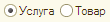{ width="110" }

!!! failure "Неправильно"

    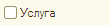{ width="110" }

###### 7.

Если на форме
присутствует группа флажков,
в подписях которых
используется общий текст,
его следует выносить
в заголовок группы.

!!! success "Правильно"

    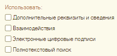{ width="237" }

!!! failure "Неправильно"

    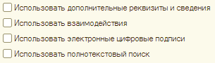{ width="305" }

###### См. также

- [#std638: Работа с неактуальными (недействительными) объектами](638.md)

###### Источник

https://its.1c.ru/db/v8std#content:622
