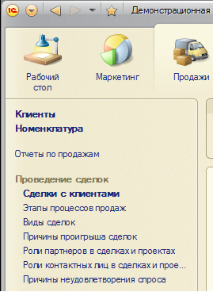

###### #std623

# Группа команд «Важное» в панели навигации

!!! warning "Устаревший стандарт"
    Этот стандарт устарел. Используйте [#std714: Навигация внутри раздела (8.3)](714.md).

`Важное` - это команды перехода в панели навигации,
выделенные жирным шрифтом.

Они могут быть:

- отдельными элементами панели навигации;
- командами внутри групп.

{ width="269" }

- Наличие группы `Важное` не является обязательным.
- Использование группы целесообразно,
  когда прогнозируется частое использование переходов
  по конкретным командам.
  Это помогает пользователям быстрее ориентироваться
  в панели навигации.
- Выделяйте не более `5` важных команд.

!!! note "Примечание"

    При большем количестве команд
    панель навигации выглядит громоздко,
    а выделение жирным шрифтом
    работает менее эффективно.

###### См. также

- [#std714: Навигация внутри раздела (8.3)](714.md)

###### Источник

https://its.1c.ru/db/v8std#content:623
