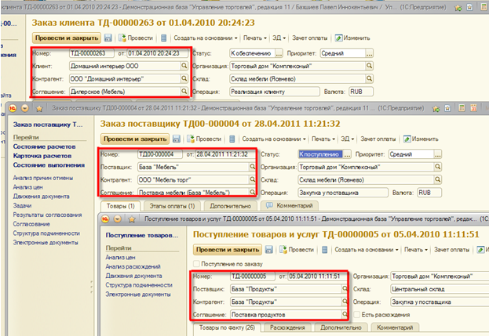

###### #std624

# Оформление элементов

Названия одних и тех же объектов
и их расположение
должны быть одинаковыми
во всех формах.

!!! example "Пример"

    `Номер`,
    `Дата документа`,
    `Клиент/Поставщик`,
    `Контрагент`,
    `Соглашение`
    всегда находятся в одном и том же месте
    независимо от документа.

    { width="623" }

###### См. также

- [#std722: Компоновка форм (8.3)](722.md)

###### Источник

https://its.1c.ru/db/v8std#content:624
