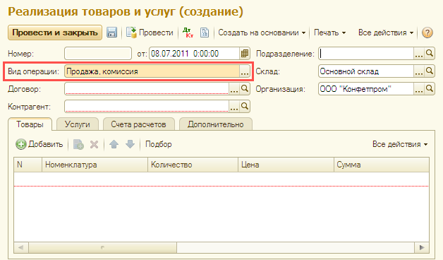
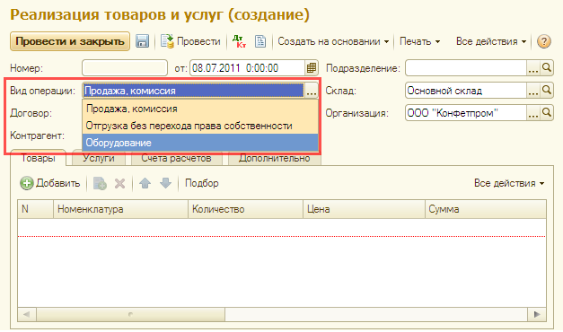

###### #std631

# Поле, влияющее на состав остальных полей в форме

Если на форме есть поле,
выбор значения в котором
существенно влияет
на состав других элементов формы,
выделяйте его визуально.

Например,
`Вид операции`,
`Вид документа` и т.п.

Это помогает:

- привлечь внимание пользователя;
- явно показать текущее значение,
  которое влияет на работу с формой.

Для выделения поля
используйте цвет фона
`ФонУправляющегоПоля`
(`RGB: 255,232,179` ).

!!! example "Примеры"

    { width="628" }
    { width="627" }

###### Источник

https://its.1c.ru/db/v8std#content:631
