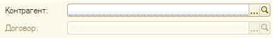

###### #std634

# Взаимосвязанные поля

Взаимосвязанные поля - это поля,
где заполнение одного поля
зависит от значения,
выбранного в другом.

!!! example "Пример"

    Заполнение поля `Договор`
    зависит от выбранного `Контрагента`.

    Заполнение поля `Подразделение`
    зависит от выбранной `Организации`.

Пользователю нужно визуально показывать,
какое поле следует заполнить первым.

Для этого поле,
которое зависит от другого,
должно быть недоступным,
пока не заполнено основное поле.

!!! example "Пример"

    Поле `Договор`
    недоступно,
    пока не заполнено поле `Контрагент`.

    { width="388" }

###### Источник

https://its.1c.ru/db/v8std#content:634
