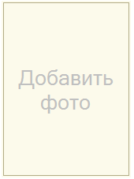
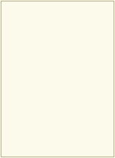

###### #std635

# Невыбранная картинка

Если в форме есть поле картинки,
которое пользователь может заполнить,
в незаполненном состоянии
оно должно явно показывать
свое назначение.

Например:

- поле для фотографии в карточке сотрудника;
- поле для изображения в справочнике номенклатуры.

!!! success "Хорошо"

    { width="170" }

!!! failure "Плохо"

    { width="162" }

Оформляйте невыбранную картинку так:

- указывайте текст
  невыбранной картинки
  (например:
  `Добавить фото`,
  `Добавить изображение`);
- для этого текста
  используйте цвет
  `ТекстНевыбраннойКартинкиЦвет`
  (`RGB: 220,220,220` );
- используйте шрифт
  `ТекстНевыбраннойКартинкиШрифт`
  (шрифт диалогов и меню,
  размер `12`).

###### Источник

https://its.1c.ru/db/v8std#content:635
