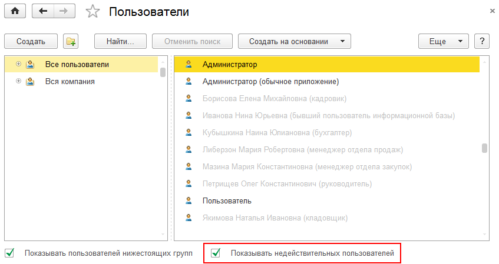

###### #std638

# Работа с неактуальными (недействительными) объектами

###### 1.

Эта рекомендация применяется, когда объект информационной базы становится неактуальным временно или постоянно (например, сотрудник уволился или ушел в декрет).

Такие объекты не удаляйте из базы, чтобы не нарушать ссылочную целостность.
Ранее созданные данные должны сохранять ссылки на них.

###### 2.

Чтобы запретить выбор неактуальных объектов через автоподбор и быстрый выбор в полях ввода, используйте один из двух подходов:

- задавать ограничение по умолчанию (п. 2.1);
- задавать ограничение в зависимости от контекста (п. 2.2).

Пример в этом стандарте: учет пользователей ведется в справочнике `Пользователи`, у которого есть реквизит `Недействителен` (`Булево`, по умолчанию `Ложь`).

###### 2.1.

Если ограничение должно действовать во всех или в большинстве полей ввода, задавайте его по умолчанию.

###### 2.1.1.

В модуле менеджера справочника `Пользователи` реализуйте обработчики `#!bsl ОбработкаПолученияДанныхВыбора` и `#!bsl ОбработкаПолученияФормы`, которые устанавливают параметры отбора.

!!! example "Пример реализации"

    ```bsl
    Процедура ОбработкаПолученияДанныхВыбора(ДанныеВыбора, Параметры, СтандартнаяОбработка)
        
        Если Не Параметры.Отбор.Свойство("Недействителен") Тогда
            Параметры.Отбор.Вставить("Недействителен", Ложь);
        КонецЕсли;

    КонецПроцедуры

    Процедура ОбработкаПолученияФормы(ВидФормы, Параметры, ВыбраннаяФорма, ДополнительнаяИнформация, СтандартнаяОбработка)
        
        Если ВидФормы = "ФормаВыбора" Тогда
            ПараметрИзменен = Ложь;

            Если Не Параметры.Свойство("Отбор") Тогда
                Параметры.Вставить("Отбор", Новый Структура("Недействителен", Ложь));
                ПараметрИзменен = Истина;
            ИначеЕсли Не Параметры.Отбор.Свойство("Недействителен") Тогда
                Параметры.Отбор.Вставить("Недействителен", Ложь);
                ПараметрИзменен = Истина;
            КонецЕсли;

            // Этот код нужен, чтобы были использованы измененные нами значения параметров.
            Если ПараметрИзменен Тогда
                СтандартнаяОбработка = Ложь;
                ВыбраннаяФорма = "ФормаВыбора"; // Передаем имя формы выбора.
            КонецЕсли;
        КонецЕсли;
        
    КонецПроцедуры
    ```

###### 2.1.2.

Для реквизитов, где поведение нужно изменить, явно задавайте свойства `Параметры выбора` и `Связи параметров выбора`:

- если нужен отбор по признаку недействительности, задайте в `Параметры выбора` значение `Отбор.Недействителен(Ложь)`;
- если ограничение не требуется, используйте оба значения: `Истина` и `Ложь`.

###### 2.2.

Если запрет на выбор неактуальных объектов сильно зависит от контекста, не задавайте его по умолчанию.

- не реализуйте модуль менеджера справочника `Пользователи`;
- в объектах с реквизитами типа `СправочникСсылка.Пользователи` задавайте `Параметры выбора` и `Связи параметров выбора` по месту;
- если критерий нельзя описать параметрами выбора, реализуйте в форме обработчики `#!bsl ОбработкаПолученияДанныхВыбора`, `#!bsl ОбработкаВыбора`, `#!bsl ОкончаниеВводаТекста` и используйте отдельную форму выбора с нужной логикой ограничения.

###### 3.

В формах списка и выбора пользователей рекомендуется добавить флажок `Показывать недействительных пользователей`.

Он позволяет:

- выбирать и открывать карточку недействительного пользователя;
- снова сделать пользователя действительным (например, при выходе сотрудника из декретного отпуска).

###### 4.

Для отображения неактуальных объектов в списках используйте элемент стиля `ТекстЗапрещеннойЯчейкиЦвет` (`192,192,192`).

{ width="847" }

###### Источник

https://its.1c.ru/db/v8std#content:638
