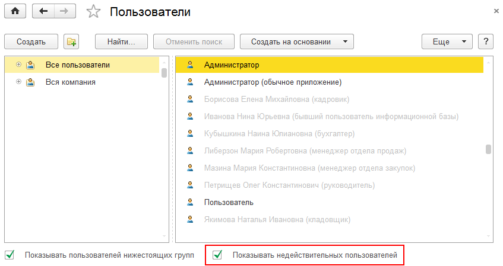

###### #std638

# Работа с неактуальными (недействительными) объектами

###### 1.

Объект может стать неактуальным временно или навсегда: сотрудник уволился или ушел в декрет, подразделение расформировано.
Не удаляйте такой объект: ранее созданные данные должны сохранять ссылки на него.
Например, автором файла остается уволившийся сотрудник.

###### 2.1.

Для объектов, поддерживающих механизм недействительности, предусмотрите булев реквизит `Недействителен` или аналогичный с начальным значением `Ложь`.

###### 2.2.

При использовании подсистемы «Недействительные объекты» БСП 3.2.2 и выше можно включить объект метаданных в состав общего реквизита `Недействителен`, не добавляя собственный реквизит.

Если реквизит называется иначе, укажите это в `#!bsl НедействительныеОбъектыПереопределяемый.ПриПолученииНастроекРаботыСНедействительными`.

###### 3.

Рекомендуется скрывать недействительные объекты в автоподборе и быстром выборе полей ввода.

###### 3.1.1.

Для переопределения скрытия или отображения используйте булево свойство `ДобавлятьНедействительныеОбъектыВДанныеВыбора` в параметрах выбора реквизита объекта или поля формы.

###### 3.1.2.

В модуле менеджера реализуйте `#!bsl ОбработкаПолученияДанныхВыбора`, который по умолчанию добавляет отбор `Недействителен = Ложь` и обрабатывает параметр `ДобавлятьНедействительныеОбъектыВДанныеВыбора`.

!!! note "Особенность примера ИТС"

    В примере первоисточника проверяется наличие параметра, а не его булево значение: даже переданное `Ложь` снимает отбор.
    Для явного включения недействительных передавайте `Истина`; для поведения по умолчанию не передавайте параметр.

При таком способе скрытия рекомендуется отключать историю выбора у соответствующего объекта метаданных.
См. [#std744: История выбора при вводе, п. 2.1](744.md#21).

###### 3.1.3.

При выборе недействительного объекта через автоподбор или быстрый выбор рекомендуется предупреждать пользователя, если объект не помечен на удаление.

В `#!bsl ОбработкаПолученияДанныхВыбора` значения элементов списка `ДанныеВыбора` для таких объектов должны быть структурами с обязательными свойствами:

- `Значение` — ссылка на объект;
- `ПометкаУдаления` — признак пометки удаления;
- `Предупреждение` — текст предупреждения о выборе.

Для помеченного на удаление объекта показывайте предупреждение о пометке удаления; для недействительного — о недействительности.

В БСП 3.2.2 и выше с подсистемой «Недействительные объекты» используйте обработчик библиотеки:

```bsl
Процедура ОбработкаПолученияДанныхВыбора(ДанныеВыбора, Параметры, СтандартнаяОбработка)
    НедействительныеОбъекты.ПриОбработкеПолученияДанныхВыбора(
        Метаданные.Справочники.Пользователи, ДанныеВыбора, Параметры, СтандартнаяОбработка);
КонецПроцедуры
```

###### 3.2.

В формах списка и выбора рекомендуется по умолчанию скрывать недействительные объекты и добавлять в меню «Еще» команду «Показать недействительные», которая переключает отбор.

В `#!bsl ПриСозданииНаСервере` включайте отбор, если стандартный параметр формы `Отбор` не содержит свойства `Недействителен`.
Если свойство передано, настройте пометку команды по его значению.

Для переключения отбора рекомендуется использовать `ФиксированныеНастройки` компоновщика настроек динамического списка, как при платформенной обработке стандартного параметра `Отбор`.

В БСП 3.2.2 и выше отбор и команду добавляет подсистема «Недействительные объекты».

###### 4.

В формах списка, выбора и элемента добавьте в меню «Еще» команду «Пометить недействительным / Снять пометку», аналогичную команде управления пометкой удаления.

В форме элемента вместо команды допустим флажок `Недействителен` или аналогичный.

###### 5.

При установке пометки удаления объект также помечается недействительным.
Снятие пометки удаления не должно автоматически снимать признак недействительности.

###### 6.

Для отображения недействительных объектов в списках рекомендуется элемент стиля `ТекстЗапрещеннойЯчейкиЦвет` (`192,192,192`).

{ width="847" }

###### Источники

- [Русская версия — ИТС](https://its.1c.ru/db/v8std#content:638)
- [English version — 1Ci Knowledge Base](https://kb.1ci.com/1C_Enterprise_Platform/Guides/Developer_Guides/1C_Enterprise_Development_Standards/Creating_and_modifying_metadata_objects/Data_storage_arrangement/Handling_inactive_objects/?language=en)
