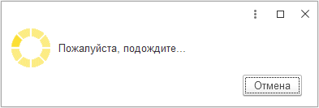

###### #std642

# Длительные операции на сервере

###### 1.

Избегайте длительных вызовов из клиентского кода на сервер.

Если серверный вызов в обычных сценариях может выполняться дольше `8` секунд, выполняйте его асинхронно через фоновое задание.

К таким операциям относятся:

- формирование отчетов;
- групповая обработка объектов;
- загрузка или выгрузка данных;
- заполнение больших табличных частей.

Если выполнять такие операции синхронно, возможны проблемы:

- браузер предложит остановить длительный скрипт, и приложение станет неработоспособным;
- веб-сервер прервет запрос и вернет ошибку `504`;
- пользователь не сможет отменить операцию.

###### 2.1.

Общий подход к асинхронному выполнению длительных серверных операций:

- код длительной обработки размещайте в модуле менеджера объекта или в общем модуле; результат сохраняйте во временное хранилище;
- запускайте фоновое задание и ждите его завершения до `0.8` сек;
- если задание не завершилось, верните управление на клиент и подключите обработчик ожидания;
- опрашивайте состояние задания с интервалом от `1` до `15` секунд, коэффициент увеличения `1.4`;
- на время выполнения операции показывайте индикатор пользователю;
- после завершения фонового задания получите результат из временного хранилища и обработайте его.

Для индикации выполнения:

- в отчетах используйте свойство поля табличного документа `#!bsl ОтображениеСостояния`;
- в остальных случаях открывайте блокирующую форму с `#!bsl РежимОткрытияОкна = БлокироватьОкноВладельца` и кнопкой `Отмена`.

!!! example "Индикатор выполнения в поле табличного документа"
    { width="320" }

!!! example "Блокирующая форма длительной операции"
    { width="500" }

!!! tip "Примечание"

    Фоновые задания могут вызывать только процедуры и функции общих модулей.
    Если основной код расположен в модуле менеджера, используйте процедуру-обертку в общем модуле и вызов через `#!bsl ОбщегоНазначения.ВыполнитьМетодКонфигурации`.

###### 2.2.

Асинхронное формирование отчета требуется для отчетов, которые:

- разработаны без СКД, или на СКД, но с переопределенным формированием (например, переопределена команда `Сформировать` или в `#!bsl ПриКомпоновкеРезультата` устанавливается `#!bsl СтандартнаяОбработка = Ложь`);
- обычно формируются долго.

Поведение таких отчетов делайте максимально близким к отчетам на СКД:

- форму отчета не блокируйте на время формирования;
- пользователь должен иметь возможность изменить настройки и переформировать отчет;
- при закрытии формы формирование должно прерываться.

###### 3.

Если используется БСП, применяйте общие модули:

- `#!bsl ДлительныеОперации`;
- `#!bsl ДлительныеОперацииКлиент`;
- `#!bsl ОбщегоНазначенияКлиентСервер` (процедура `#!bsl УстановитьСостояниеПоляТабличногоДокумента`).

Пример выполнения функции в фоновом задании.

Функция в модуле менеджера:

```bsl
Функция ОпределитьНастройкиУчетнойЗаписи(АдресЭлектроннойПочты, Пароль) Экспорт
    ...
    Возврат Настройки;
КонецФункции
```

В форме вызывайте ее в три этапа:

```bsl
&НаКлиенте
Процедура НастроитьПараметрыПодключенияАвтоматически()

    ДлительнаяОперация = НачатьПоискНастроекУчетнойЗаписи(); // (1)

    ПараметрыОжидания = ДлительныеОперацииКлиент.ПараметрыОжидания(ЭтотОбъект); // (2)
    Оповещение = Новый ОписаниеОповещения("ПриЗавершенииПоискаНастроек", ЭтотОбъект);
    ДлительныеОперацииКлиент.ОжидатьЗавершение(ДлительнаяОперация, Оповещение, ПараметрыОжидания);

КонецПроцедуры
```

1. Запуск фонового задания на сервере.
2. Подключение обработчика завершения фонового задания.

```bsl
&НаСервере
Функция НачатьПоискНастроекУчетнойЗаписи()

    ПараметрыВыполнения = ДлительныеОперации.ПараметрыВыполненияФункции(УникальныйИдентификатор);
    Возврат ДлительныеОперации.ВыполнитьФункцию(
        ПараметрыВыполнения,
        "Справочники.УчетныеЗаписиЭлектроннойПочты.ОпределитьНастройкиУчетнойЗаписи",
        АдресЭлектроннойПочты,
        Пароль
    );

КонецФункции
```

```bsl
&НаКлиенте
Процедура ПриЗавершенииПоискаНастроек(Результат, ДополнительныеПараметры) Экспорт

    Если Результат = Неопределено Тогда // (1)
        Возврат;
    КонецЕсли;

    Если Результат.Статус = "Ошибка" Тогда
        СтандартныеПодсистемыКлиент.ВывестиИнформациюОбОшибке(Результат.ИнформацияОбОшибке);
        Возврат;
    КонецЕсли;

    Настройки = ПолучитьИзВременногоХранилища(Результат.АдресРезультата);
    УдалитьИзВременногоХранилища(Результат.АдресРезультата);
    УстановитьНастройкиУчетнойЗаписи(Настройки);

КонецПроцедуры
```

1. Пользователь отменил задание.


###### 3.1.

При каждом запуске фонового задания результат помещается во временное хранилище на время жизни формы.
Если пользователь запускает операцию много раз, хранилища накапливаются и растет потребление памяти.

После получения результата обычно сразу удаляйте его из временного хранилища:

```bsl
Настройки = ПолучитьИзВременногоХранилища(Результат.АдресРезультата);
УдалитьИзВременногоХранилища(Результат.АдресРезультата); // (1)
```

1. Данные больше не требуются.

Если результат нужен в нескольких серверных вызовах, передавайте заранее инициализированный фиксированный адрес:

```bsl
&НаСервере
Процедура ПриСозданииНаСервере(Отказ)
    АдресРезультатаФоновогоЗадания = ПоместитьВоВременноеХранилище(Неопределено, УникальныйИдентификатор); // (1)
КонецПроцедуры

&НаСервере
Функция НачатьПоискНастроекУчетнойЗаписи()
    ПараметрыВыполнения = ДлительныеОперации.ПараметрыВыполненияФункции(УникальныйИдентификатор); // (2)
    ПараметрыВыполнения.АдресРезультата = АдресРезультатаФоновогоЗадания;
    ...
КонецФункции
```

1. Резервируем адрес временного хранилища
2. Всегда используем одно и то же временное хранилище

###### 4.

Если алгоритмы запускают фоновые задания или записывают данные без участия пользователя (например, при регулярном обновлении формы), проверяйте, что не включен монопольный режим.

Если монопольный режим включен, блокируйте выполнение таких действий.

```bsl
Если МонопольныйРежим() Тогда
    Возврат;
КонецЕсли;

ФоновыеЗадания.Выполнить("...");
```

###### 5.

Иногда длительная операция требует монопольного режима.
Например:

- обновление данных ИБ после обновления конфигурации;
- удаление помеченных объектов;
- выгрузка ИБ в файл для перехода в сервис;
- массовые операции изменения данных.

В этом случае сначала включите монопольный режим, затем запускайте фоновое задание.
Фоновое задание унаследует монопольный режим сеанса.

На время выполнения блокируйте весь интерфейс, открыв форму ожидания с `#!bsl РежимОткрытияОкна = БлокироватьВесьИнтерфейс`.

Это нужно, потому что полноценная работа пользователя в этот момент невозможна:

- попытка записи объектов приведет к ошибке из-за монопольного режима;
- фоновые задания, которые запускаются реактивно по действиям пользователя, тоже завершатся с ошибкой.

На форме ожидания не размещайте элементы, которые запускают фоновые операции:

- поля ввода;
- динамические списки;
- отчеты.

!!! tip "Примечание"

    Ошибки записи возникают и при программной записи объектов (например, из обработчиков ожидания).
    В таком коде тоже проверяйте `#!bsl МонопольныйРежим()` по правилам [п.4](#4).

###### См. также

- [#std755: Длительные операции на клиенте](755.md)

###### Источник

https://its.1c.ru/db/v8std#content:642
