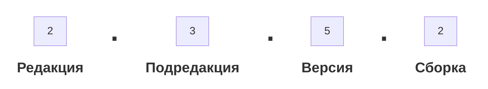

###### #std644

# Обеспечение совместимости библиотек

###### 1.

При разработке библиотек обеспечивайте обратную совместимость
между версиями в пределах одной [#std483: подредакции](483.md).

Например, версии `2.0.1`, `2.0.2`, `2.0.5` должны быть совместимы друг с другом.
Следующая подредакция (`2.1`) может содержать изменения,
которые нарушают совместимость.

Совместимость снижает затраты на обновление библиотек в конфигурациях-потребителях:

- прикладным разработчикам не нужно часто пересматривать код;
- конфигурация-потребитель может безопасно использовать старые возможности,
  даже если на новые еще не перешли;
- при разработке нескольких взаимозависимых библиотек
  можно развивать «соседние» библиотеки на разных версиях базовой,
  без частого обновления всего дерева библиотек.

###### 1.1.

Полный номер версии библиотеки должен однозначно показывать
характер изменений и совместимость.

<table>
  <thead>
    <tr>
      <th>Что изменилось в новой версии</th>
      <th style="text-align:center;"><code>Редакция</code></th>
      <th style="text-align:center;min-width:9.5rem;"><code style="white-space:nowrap;">Подредакция</code></th>
      <th style="text-align:center;"><code>Версия</code></th>
      <th style="text-align:center;"><code>Сборка</code></th>
    </tr>
  </thead>
  <tbody>
    <tr>
      <td>Архитектурные изменения, нарушена совместимость (есть инструкция по переходу)</td>
      <td style="text-align:center;background:#00c8531a;">
        <span aria-label="Да" style="font-size:1.1em;font-weight:700;line-height:1;color:#00c853;">&#10003;</span>
      </td>
      <td style="text-align:center;background:#00c8531a;">
        <span aria-label="Да" style="font-size:1.1em;font-weight:700;line-height:1;color:#00c853;">&#10003;</span>
      </td>
      <td style="text-align:center;background:#ff52521a;">
        <span aria-label="Нет" style="font-size:1.1em;font-weight:700;line-height:1;color:#ff5252;">&#10005;</span>
      </td>
      <td style="text-align:center;background:#ff52521a;">
        <span aria-label="Нет" style="font-size:1.1em;font-weight:700;line-height:1;color:#ff5252;">&#10005;</span>
      </td>
    </tr>
    <tr>
      <td>Новые функции</td>
      <td style="text-align:center;background:#00c8531a;">
        <span aria-label="Да" style="font-size:1.1em;font-weight:700;line-height:1;color:#00c853;">&#10003;</span>
      </td>
      <td style="text-align:center;background:#00c8531a;">
        <span aria-label="Да" style="font-size:1.1em;font-weight:700;line-height:1;color:#00c853;">&#10003;</span>
      </td>
      <td style="text-align:center;background:#00c8531a;">
        <span aria-label="Да" style="font-size:1.1em;font-weight:700;line-height:1;color:#00c853;">&#10003;</span>
      </td>
      <td style="text-align:center;background:#ff52521a;">
        <span aria-label="Нет" style="font-size:1.1em;font-weight:700;line-height:1;color:#ff5252;">&#10005;</span>
      </td>
    </tr>
    <tr>
      <td>Исправлены ошибки</td>
      <td style="text-align:center;background:#00c8531a;">
        <span aria-label="Да" style="font-size:1.1em;font-weight:700;line-height:1;color:#00c853;">&#10003;</span>
      </td>
      <td style="text-align:center;background:#00c8531a;">
        <span aria-label="Да" style="font-size:1.1em;font-weight:700;line-height:1;color:#00c853;">&#10003;</span>
      </td>
      <td style="text-align:center;background:#00c8531a;">
        <span aria-label="Да" style="font-size:1.1em;font-weight:700;line-height:1;color:#00c853;">&#10003;</span>
      </td>
      <td style="text-align:center;background:#00c8531a;">
        <span aria-label="Да" style="font-size:1.1em;font-weight:700;line-height:1;color:#00c853;">&#10003;</span>
      </td>
    </tr>
  </tbody>
</table>

Номер версии:

<div style="width: 50%;" markdown="1">



</div>

Расшифровка:

1. `Редакция` (1-я цифра) — существенно нарушена совместимость,
   есть серьезные архитектурные или «знаковые» изменения.
2. `Подредакция` (2-я цифра) — нарушена совместимость,
   требуется инструкция по переходу,
   без адаптации конфигурация неработоспособна;
   также допускается удаление устаревших объектов метаданных.
3. `Версия` (3-я цифра) — только новые возможности
   для пользователей и/или разработчиков;
   возможна механическая автозаливка метаданных;
   инструкция по переходу не обязательна,
   без нее работоспособность сохраняется.
4. `Сборка` (4-я цифра) — только исправления ошибок;
   возможна механическая автозаливка метаданных.

Исключения, которые можно согласовать заранее с потребителями:

- изменения законодательства:
  если следующая версия еще не опубликована,
  допускается выпуск исправительных сборок для всех поддерживаемых веток,
  даже при добавлении функций или нарушении совместимости;
  вынужденное нарушение должно быть описано в документации по правилам [раздела 1.8](#18)
  и обязательно к отработке;
- LTS-версии:
  в исправительные релизы таких версий могут входить
  не только исправления ошибок и законодательные изменения,
  но и отдельные важные доработки,
  даже если они добавляют функции или нарушают совместимость.

Удаление устаревших объектов метаданных выполняйте по графику:

- не чаще одного раза в год;
- в версиях, запланированных ближе к концу года;
- удаляемые объекты должны существовать не менее двух лет.

В документации к «концу года» отмечайте,
что версия обязательна для перехода,
чтобы гарантировать перенос или очистку данных для реструктуризации.

Недопустимо требовать от типовых решений обязательный переход
чаще одного раза в год суммарно по всем библиотекам.

###### 1.2.

Если библиотека содержит несколько [#std543: функциональных подсистем](543.md),
нарушение совместимости хотя бы в одной из них
требует увеличения номера подредакции (вторая цифра).

###### 1.3.

Если совместимость незапланированно нарушена
в третьей или четвертой цифре версии,
релиз следует отозвать,
устранить нарушение и выпустить исправленный релиз.

###### 1.4.

Аналогично, незапланированное добавление новых функций
в четвертой цифре версии также требует отзыва релиза
и выпуска исправленного.

###### 1.5.

Для обеспечения совместимости:

- выделяйте программный интерфейс библиотеки,
  скрывая от потребителей детали реализации;
- не изменяйте программный интерфейс и поведение,
  его допустимо только расширять.

Требования обратной совместимости имеют приоритет
над стандартами:

- [#std474: Имя, синоним, комментарий](474.md)
- [#std647: Имена процедур и функций](647.md)

###### 1.6.

К программному интерфейсу библиотеки относятся объекты,
предназначенные для использования в прикладном коде:

- имена, состав параметров и поведение экспортных процедур и функций,
  размещенных в [#std455: разделе «Программный интерфейс»](455.md);
- имена, состав параметров и поведение всех экспортных процедур
  [#std553: переопределяемых общих модулей](553.md);
- имена ролей и элементов стилей;
- имена объектов метаданных
  (включая реквизиты, табличные части и т.п.),
  к которым допускается прямое обращение из прикладного кода или запросов.

###### 1.7.

Совместимость не нарушается при расширении интерфейса
в третьей цифре версии. Допустимо:

- добавить новую функцию в программный модуль;
- добавить процедуру в переопределяемый модуль;
- добавить новый необязательный параметр в конец списка параметров;
- добавить новый реквизит в справочник, регистр и т.п.,
  если библиотека допускает к ним прямые обращения.

При этом:

- новое API и расширение параметров существующего API
  недопустимы в исправительных релизах (четвертая цифра);
- даже при неизменной сигнатуре,
  изменение поведения процедуры/функции — это нарушение совместимости
  (допустимо только во второй цифре).

Пример: функция `Сумма(а, б)` начала вычислять разность.

###### 1.8.

Во всех случаях, когда по [разделу 1](#1) допустим отказ от совместимости,
документируйте все изменения,
которые нарушают совместимость.

Сопроводительная документация должна содержать инструкции
по адаптации конфигураций-потребителей.

Примеры формулировок:

- общий модуль `ВнешниеЗадачиСервер` переименован в `ВнешниеЗадачи`;
  нужно заменить обращения к модулю в коде конфигурации;
- процедура `УстановитьПроизвольныйЗаголовокПриложения`
  общего модуля `СтандартныеПодсистемыКлиент`
  переименована в `УстановитьРасширенныйЗаголовокПриложения`;
  нужно заменить обращения в коде;
- отчет `СправкаПоИсполнительскойДисциплине` удален;
  вместо него используйте одноименный вариант отчета `Задачи`;
  нужно заменить обращения в коде и метаданных;
- в общий модуль `ЗащитаПерсональныхДанныхПереопределяемый`
  нужно добавить процедуру
  `ДополнитьДанныеОрганизацииОператораПерсональныхДанных`,
  перенеся ее из поставки библиотеки;
- хранение предмета взаимодействий перенесено из реквизита документа
  в реквизит `Предмет` регистра сведений `ПредметыПапкиВзаимодействий`;
  нужно заменить обращения к реквизиту `Предмет` документов
  на реквизит `Предмет` регистра.

###### 1.9.

Размещайте программный интерфейс библиотеки
только в общих модулях,
а не в модулях объектов, менеджеров, наборов записей и т.п.

###### 2.1.

Разделяйте программный интерфейс
и служебные процедуры/функции:

- в разных разделах одного модуля;
- или в разных общих модулях.

Если интерфейс и служебная реализация разнесены по разным модулям,
для служебного модуля используйте постфикс `Служебный` (`Internal`).

Например:

- `ОбменСообщениями`, `ОбменСообщениямиКлиент` — программный интерфейс подсистемы;
- `ОбменСообщениямиСлужебный` — служебная реализация,
  не предназначенная для использования в коде конфигурации-потребителя.

Такой подход позволяет:

- сосредоточить API в небольшом и обозримом наборе модулей;
- показывать в контекстной подсказке только то,
  что действительно относится к API.

###### 2.2.

Раздел `Программный интерфейс` может содержать
процедуры и функции для конкретных потребителей
из других подсистем или библиотек.

Выделяйте их в отдельный подраздел
`Для вызова из других подсистем`,
оформленный областью `ДляВызоваИзДругихПодсистем`
(англ. `InterfaceImplementation`).

Внутри подраздела группируйте код комментариями
по имени потребителя.
Подробнее: [#std551: Разработка конфигураций с повторным использованием общего кода и объектов метаданных](551.md).

Пример:

```bsl
#Область ПрограммныйИнтерфейс
// Код процедур и функций

#Область ДляВызоваИзДругихПодсистем

// СтандартныеПодсистемы.ГрупповоеИзменениеОбъектов
// Код процедур и функций
// Конец СтандартныеПодсистемы.ГрупповоеИзменениеОбъектов

// ТехнологияСервиса.ВыгрузкаЗагрузкаДанных
// Код процедур и функций
// Конец ТехнологияСервиса.ВыгрузкаЗагрузкаДанных

#КонецОбласти

#КонецОбласти
```

Англоязычный вариант:

```bsl
#Region Public
// Enter code here.

#Region InterfaceImplementation

// StandardSubsystems.BatchObjectModification
// Enter code here.
// End StandardSubsystems.BatchObjectModification

// SaaSTechnology.DataExportImport
// Enter code here.
// End SaaSTechnology.DataExportImport

#EndRegion

#EndRegion
```

###### 3.

Практические рекомендации для сохранения совместимости API
при активном развитии библиотеки.

###### 3.1.

Если нужно переименовать или удалить экспортную функцию/процедуру,
оставьте прежнюю реализацию,
пометьте ее как устаревшую
(англоязычный маркер — `Deprecated`),
и добавьте новую функцию с новым именем.

```bsl
#Область УстаревшиеПроцедурыИФункции

// Устарела: Следует использовать функцию ПересчитатьПоКурсу
// ...
Функция ПересчитатьИзВалютыВВалюту(
    Сумма,
    ВалютаНач,
    ВалютаКон,
    ПоКурсуНач,
    ПоКурсуКон,
    ПоКратностьНач = 1,
    ПоКратностьКон = 1) Экспорт

...

#КонецОбласти
```

Устаревшие функции переносите в область
`УстаревшиеПроцедурыИФункции` (`Deprecated`)
внутри `ПрограммныйИнтерфейс`.

Для процедур и функций в области `УстаревшиеПроцедурыИФункции`
допустимы отклонения от других стандартов разработки.

По каждой устаревшей функции добавляйте
в сопроводительную документацию рекомендацию по замене.

###### 3.2.

Если исправление ошибки меняет поведение экспортной функции,
часто лучше оставить старую реализацию как устаревшую,
а исправленную вынести в новый API.

Это сохраняет работоспособность прикладного кода,
который уже опирается на старое поведение.

Даже изменение поведения в нештатных
или незадокументированных сценариях может вызвать
массовые ошибки у потребителей.

Типовой риск: вызывающий код при некорректных параметрах
ожидает `#!bsl Неопределено`, а после «исправления» функция
начинает выбрасывать исключение.

###### 3.3.

Если нужно пересмотреть состав параметров,
используйте опциональные параметры
и добавляйте их в конец списка.

```bsl
Функция ПересчитатьИзВалютыВВалюту(
    Сумма,
    ВалютаНач,
    ВалютаКон,
    ПоКурсуНач,
    ПоКурсуКон,
    ПоКратностьНач = 1,
    ПоКратностьКон = 1) Экспорт
```

Если параметров много,
используйте последним параметр типа `Структура`:

```bsl
Функция ПересчитатьИзВалютыВВалюту(
    Сумма,
    ВалютаНач,
    ВалютаКон,
    ПоКурсуНач,
    ПоКурсуКон,
    ПараметрыПересчета = Неопределено) Экспорт
```

###### 3.4.

Параметры типа `Структура` используйте также
для совместимости интерфейса,
через который библиотека обращается
к объектам конфигурации-потребителя.

```bsl
Процедура ПриОпределенииНастроек(Настройки) Экспорт
    Настройки.ВыводитьОписания = Истина;
    Настройки.События.ПриСозданииНаСервере = Истина;
    Настройки.... = ...;
КонецПроцедуры
```

Так библиотека может добавлять новые режимы и события
без обязательного добавления «пустых заглушек»
во всех конфигурациях-потребителях.

###### 3.5.

Чтобы прикладной код не зависел от деталей реализации библиотеки,
избегайте прямых обращений к ее объектам метаданных.

Предоставляйте специализированные экспортные функции API,
через которые потребитель получает нужные данные.

Вместо прямого запроса к библиотечному регистру
в коде конфигурации-потребителя:

```bsl
Запрос = Новый Запрос;
Запрос.Текст =
    "ВЫБРАТЬ
    |   ОбластиДанных.Представление
    |ИЗ
    |   РегистрСведений.ОбластиДанных КАК ОбластиДанных
    |ГДЕ
    |   ОбластиДанных.ОбластьДанных = &ОбластьДанных";
Запрос.УстановитьПараметр("ОбластьДанных", ПараметрыСеанса.ОбластьДанныхЗначение);
ТаблицаОбластейДанных = Запрос.Выполнить().Выгрузить();
ИмяПриложения = ?(ТаблицаОбластейДанных.Количество() = 0, "", ТаблицаОбластейДанных.Получить(0).Получить(0));
```

используйте библиотечную функцию:

```bsl
ИмяПриложения = РаботаВМоделиСервиса.ИмяПриложения();
```

Если в текущей версии нужной функции еще нет,
в прикладном коде допустима временная обертка,
которую при следующем обновлении можно заменить
на библиотечный эквивалент.

###### 3.6.

Чтобы скрывать детали реализации от потребителя,
размещайте программный интерфейс в обычном общем модуле,
а не в специализированном (`ПовтИсп`, `ВызовСервера`).

Например, если экспортная функция сначала была в `ПовтИсп`,
а позже переносится в обычный модуль,
потребителю придется менять вызовы.

Чтобы этого избежать,
сразу размещайте экспортную функцию в обычном модуле
(в разделе `ПрограммныйИнтерфейс`),
а специализированные модули используйте как внутренние.

Также модули `ВызовСервера` должны отвечать требованиям:

- [#std678: безопасности](678.md);
- [#std487: минимизации данных, передаваемых между клиентом и сервером](487.md).

Их проще развивать,
когда они служебные,
не содержат программный интерфейс
и не являются переопределяемыми.

###### 4.

Для контроля изменений программного интерфейса
в новых версиях библиотек
используйте приложенную обработку:

- [Контроль изменения программного интерфейса на ИТС(zip)](https://its.1c.ru/db/files/1CITS/EXE/V8Std/Контрольизмененияпрограммногоинтерфейса/Контрольизмененияпрограммногоинтерфейса.zip)

###### См. также

- [#std483: Нумерация редакций и версий](483.md)
- [#std455: Структура модуля](455.md)
- [#std469: Правила создания общих модулей](469.md)
- [#std474: Имя, синоним, комментарий](474.md)
- [#std551: Разработка конфигураций с повторным использованием общего кода и объектов метаданных](551.md)
- [#std553: Переопределяемые и поставляемые объекты библиотеки](553.md)
- [#std647: Имена процедур и функций](647.md)

###### Источник

https://its.1c.ru/db/v8std#content:644
