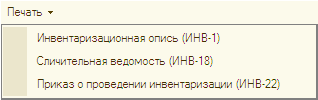
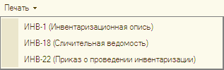

###### #std645

# Названия печатных форм учетных документов и команд по их выводу на печать

Рекомендации распространяются
на формы первичных учетных документов,
утвержденные Росстатом (Госкомстатом).

Например,
первичные документы
по учету торговых операций,
кассовых операций,
материалов,
кадров.

Как правило,
такие учетные документы
имеют в названии кодовое обозначение.

Например,
`ТОРГ-12`
для товарной накладной.

Стандарт следует применять:

- к названиям печатных форм документов;
- к заголовкам команд
  по выводу этих форм на печать.

Название печатной формы
и заголовок команды печати
рекомендуется делать одинаковыми.

Названия необходимо оформлять единообразно,
придерживаясь следующих рекомендаций.

###### 1.

Название,
по возможности,
следует делать кратким.

Например,
`Приказ о приеме (Т-1)`
вместо
`Приказ (распоряжение) о приеме работника на работу (Т-1)`.

###### 2.

В названии можно использовать
общепринятые сокращения.

Например,
`Акт о приеме-передаче ТМЦ`.

###### 3.

В название следует включать
кодовое обозначение.

Например,
`Товарная накладная (ТОРГ-12)`,
`Накладная на отпуск материалов (М-15)`,
`Личная карточка (Т-2)`.

Кодовое обозначение
следует размещать
в конце названия,
в круглых скобках,
чтобы оно не затрудняло
поиск нужной команды
по первым буквам.

!!! success "Хорошо"

    { width="318" }

!!! failure "Плохо"

    { width="317" }

###### 4.

Из названия
должно быть понятно
назначение документа.

Не допускается использовать:

- обобщенные и обезличенные словосочетания;
- только указание на кодовое обозначение.

!!! success "Хорошо"

    `Расчетная ведомость (Т-51)`

!!! failure "Плохо"

    - `Унифицированная форма (Т-51)`
    - `Расчетная ведомость по форме Т-51`
    - `Расчетная ведомость (ф. Т-51)`

См. также:
[Формирование печатных форм](https://its.1c.ru/db/v8std/content/548/hdoc).

###### Источник

https://its.1c.ru/db/v8std#content:645
