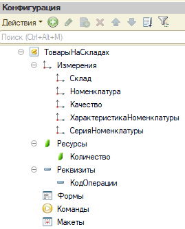

###### #std652

# Несоответствие индексов и условий запроса

###### 1.1.

Проверяйте,
что для всех условий запроса
есть подходящие индексы.

Условия встречаются в секциях:

- `#!sdbl ВЫБРАТЬ ... ИЗ ... ГДЕ <условие>`;
- `#!sdbl СОЕДИНЕНИЕ ... ПО <условие>`;
- `#!sdbl ВЫБРАТЬ ... ИЗ <ВиртуальнаяТаблица>(, <условие>)`;
- `#!sdbl ИМЕЮЩИЕ <условие>`.

Подходящий индекс должен:

1. содержать все поля из условия;
2. содержать эти поля в начале индекса;
3. содержать эти поля подряд,
   без «вклинивания» других полей.

###### 1.2.

Если подходящего индекса нет,
СУБД будет сканировать таблицу
или один из ее индексов.
Это увеличивает время выполнения запроса
и может снижать параллельность
из-за роста количества блокировок.

Требования связаны
с физической структурой индекса.
Индекс - это дерево,
где значения полей
идут по уровням:
сначала первое поле,
потом второе и далее.

Быстрый поиск возможен,
когда фильтрация идет
по непрерывному префиксу полей индекса.
Если условия по первому полю нет,
индекс теряет эффективность.
Если между используемыми полями
есть пропуски,
индекс применяется только частично.

###### 2.

При создании объектов метаданных
`1С:Предприятие`
автоматически создает индексы,
которые покрывают большинство запросов.

Основные автоматически создаваемые индексы:

- по уникальному идентификатору (ссылке)
  для объектных сущностей;
- по регистратору
  для таблиц движений регистров,
  подчиненных регистратору;
- по периоду
  и всем измерениям
  для итоговых таблиц регистров накопления;
- по периоду,
  счету
  и всем измерениям
  для итоговых таблиц регистров бухгалтерии.

###### 3.

Если автоматических индексов недостаточно,
можно дополнительно индексировать
реквизиты объектов метаданных.

Реквизиты справочников и документов
рекомендуется индексировать
с дополнительным упорядочиванием.
Так индекс учитывает сортировку
по полям основного представления
и эффективнее работает,
например,
когда в списке есть отбор по реквизиту,
а сам список упорядочен
по полям основного представления.

Учитывайте компромисс:
индекс ускоряет поиск,
но может замедлить
добавление,
изменение
и удаление данных.
Индексы добавляйте осознанно,
под конкретные запросы.
Не создавайте индексы
«на всякий случай»
и заведомо избыточные индексы.

В частности:

- не индексируйте дополнительно
  первое измерение регистра:
  для него уже есть основной индекс
  итоговой таблицы,
  автоматически создаваемый платформой;
- не индексируйте низкоселективные поля
  (например,
  реквизит типа `#!bsl Булево`),
  кроме специальных случаев,
  когда незначительная часть записей
  всегда имеет одно значение,
  и запросы всегда выбирают записи
  именно по нему.

###### Примеры

В конфигурации описан
регистр накопления **ТоварыНаСкладах**:

{ width="269" }

Платформа автоматически создаст
для таблицы остатков этого регистра
индекс по периоду и всем измерениям
в порядке,
заданном в конфигураторе.

!!! failure "Запрос 1: Неправильно"

    ```bsl
    Запрос.Текст = "ВЫБРАТЬ
    |   ТоварыНаСкладахОстатки.Склад,
    |   ТоварыНаСкладахОстатки.Номенклатура,
    |   ТоварыНаСкладахОстатки.Качество
    |ИЗ
    |   РегистрНакопления.ТоварыНаСкладах.Остатки(, Номенклатура = &Номенклатура) КАК ТоварыНаСкладахОстатки";
    ```

    Нарушено требование `2` из п. `1.1`:
    в условии нет отбора
    по первому полю индекса (`Склад`).
    СУБД придется перебирать
    весь индекс или таблицу.

    Варианты оптимизации:

    - проиндексировать измерение **Номенклатура**;
    - поставить **Номенклатура** первым измерением
      (осторожно,
      это может замедлить другие запросы).

!!! failure "Запрос 2: Неправильно"

    ```bsl
    Запрос.Текст = "ВЫБРАТЬ
    |   ТоварыНаСкладахОстатки.Склад,
    |   ТоварыНаСкладахОстатки.Номенклатура,
    |   ТоварыНаСкладахОстатки.ХарактеристикаНоменклатуры
    |ИЗ
    |   РегистрНакопления.ТоварыНаСкладах.Остатки(
    |       ,
    |       ХарактеристикаНоменклатуры = &ХарактеристикаНоменклатуры
    |       И Номенклатура = &Номенклатура
    |       И Склад = &Склад) КАК ТоварыНаСкладахОстатки";
    ```

    Нарушено требование `3` из п. `1.1`:
    между **Номенклатура**
    и **ХарактеристикаНоменклатуры**
    в структуре регистра
    находится поле **Качество**,
    которого нет в условии.

    Варианты оптимизации:

    - проиндексировать **ХарактеристикаНоменклатуры**;
    - поменять местами
      **Качество**
      и **ХарактеристикаНоменклатуры**
      (только если выигрыш критичен,
      так как это может ухудшить
      другие запросы).

!!! success "Запрос 3: Правильно"

    ```bsl
    Запрос.Текст = "ВЫБРАТЬ
    |   ТоварыНаСкладахОстатки.Склад,
    |   ТоварыНаСкладахОстатки.Номенклатура,
    |   ТоварыНаСкладахОстатки.Качество,
    |   ТоварыНаСкладахОстатки.КоличествоОстаток
    |ИЗ
    |   РегистрНакопления.ТоварыНаСкладах.Остатки(
    |       ,
    |       Номенклатура = &Номенклатура
    |       И Склад = &Склад) КАК ТоварыНаСкладахОстатки";
    ```

    Здесь требования соответствия
    индекса и условий
    не нарушены,
    поэтому запрос
    может выполняться оптимально.

Порядок условий в тексте запроса
не обязан совпадать
с порядком полей в индексе.

###### См. также

- [#metod1590: Индексы таблиц базы данных](../metod8dev/1590.md)
- [#std658: Эффективные условия запросов](658.md)

###### Источник

https://its.1c.ru/db/v8std#content:652
