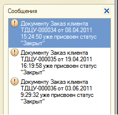
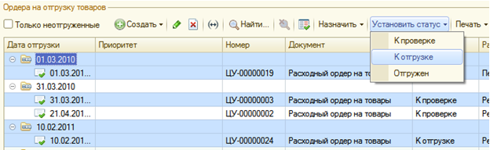
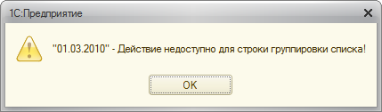

###### #std653

# Групповые обработки в списках

Проблемы,
которые нужно предотвратить при групповых обработках:

- разные отклики программы
  на одинаковые действия пользователя;
- отсутствие отклика программы
  на действие пользователя.

###### 1.

При групповой обработке
сообщайте пользователю
о количестве успешно выполненных операций.

!!! example "Пример"

    При изменении статуса
    у выделенных заказов клиентов
    программа сообщает,
    что статус успешно изменен у всех заказов.

    { width="255" }

    При ошибках
    программа также должна дать явный отклик:

    { width="255" }

###### 2.

Пользователя нельзя оставлять без отклика,
если в процессе групповой обработки
возникли ошибки.

Если часть или все объекты
обработать не удалось,
об этом нужно сообщить.

!!! example "Пример"

    Пользователь пытается изменить статус заказов клиентов
    из `Закрыт` в `Закрыт`.
    Система сообщает,
    что документы уже находятся в этом статусе
    и менять его не требуется.

    { width="234" }
    { width="255" }

###### 3.

Групповые обработки
в списках с группировкой
должны учитывать следующие правила:

- если выделены несколько строк,
  включая строки группировки,
  при обработке строки группировки игнорируются;
  обработка применяется только к выделенным строкам данных;
- если выделена только строка группировки
  и запущена групповая обработка,
  выводится платформенное сообщение.

!!! example "Пример"

    { width="624" }
    { width="429" }

###### Источник

https://its.1c.ru/db/v8std#content:653
