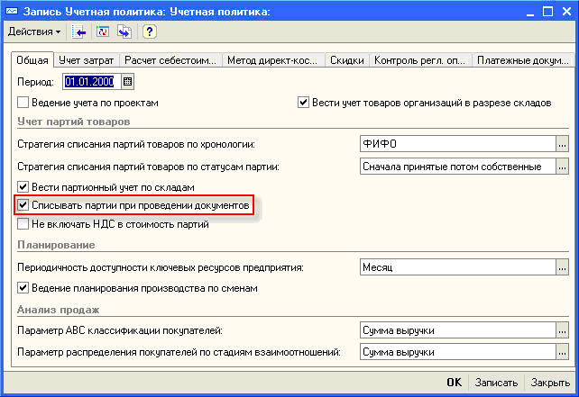

###### #std662

# Сдвиг границы последовательности документов

###### 1.

Не рекомендуется сдвигать границу последовательности при проведении документов.
Это может вызывать ожидания на блокировках и снижать общую производительность системы.

Сдвиг границы последовательности лучше выносить из оперативных операций в регламентные.
Например, выполнять его периодической обработкой с заданной частотой.

Граница последовательности по одному набору значений измерений - это один ресурс.
Если несколько пользователей одновременно сдвигают границу по одному и тому же набору значений, они блокируют друг друга.

###### Пример

В системе на базе `УПП 1.x` может использоваться учетная политика
с оперативным расчетом себестоимости списания (в момент проведения документа).

!!! example "Пример настройки в УПП"

    { width="642" }

Алгоритмы партионного учета в `УПП 1.x` используют последовательность `Партионный учет`
с одним измерением `Организация`.

Чтобы рассчитать себестоимость при проведении расходного документа, нужно сдвигать границу последовательности для организации на момент этого документа.

Если два пользователя одновременно проводят расходные документы по одной организации,
они будут блокировать друг друга.

Это не особенность механизма последовательностей `1С:Предприятия`,
а следствие требований самого алгоритма:
конкурирующие по времени документы должны выстроиться в строгом порядке.

Из-за этого оперативный сдвиг границы может значительно снизить производительность.
В таком сценарии корректнее отказаться от оперативного расчета себестоимости
и выполнять расчет регламентной обработкой с заданной частотой.

###### См. также

- [#std659: Общие сведения об избыточных блокировках](659.md)

###### Источник

https://its.1c.ru/db/v8std#content:662
