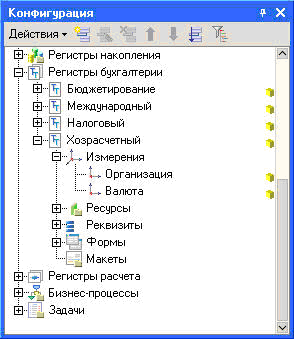
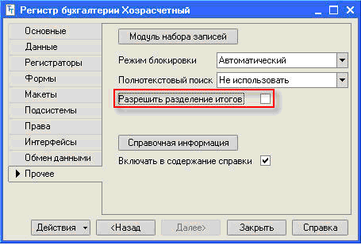
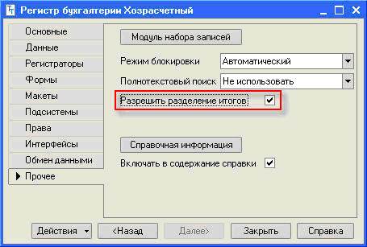
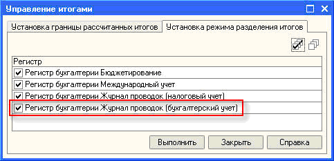

###### #std663

# Режим разделения итогов для регистров бухгалтерии

###### 1.

Если движения по бухгалтерскому регистру записываются оперативно в многопользовательском режиме, рекомендуется включить разделение итогов.

При включенном режиме пользователи могут параллельно обновлять таблицу остатков даже при совпадении периода, счета и значений измерений.

Без разделения итогов таблица остатков может стать узким местом при конкурентной работе большого числа пользователей.

Если одновременно выполняется контроль остатков, ориентируйтесь на рекомендации [#std661: блокирующего чтения остатков](661.md).

###### Пример 1

В конфигурации есть регистр `Хозрасчетный` с измерениями `Организация` и `Валюта`.

!!! example "Регистр без разделения итогов"

    { width="294" }

    { width="455" }

Если два пользователя одновременно проводят документы, они блокируют друг друга, когда движения:

- относятся к одному периоду;
- относятся к одному счету;
- имеют одинаковые значения измерений (организация и валюта).

В реальных сценариях такое совпадение происходит часто, поэтому возникают ожидания блокировок и снижается производительность.

###### Пример 2

Для того же регистра включите разделение итогов.

!!! example "Включение разделения итогов"

    { width="455" }

    { width="483" }

После включения пользователи смогут параллельно записывать движения даже при совпадении периода, счета и всех измерений.

Если при этом выполняется контроль остатков, эффект от разделения итогов ограничен.

###### См. также

- [#std661: Блокирующее чтение остатков в начале транзакции](661.md)
- [Устройство и использование режима разделения итогов регистров (статья на ИТС)](https://its.1c.ru/db/metod81/content/1393/hdoc)
- [#std733: Эффективное обращение к виртуальной таблице «Остатки»](733.md)

###### Источник

https://its.1c.ru/db/v8std#content:663
