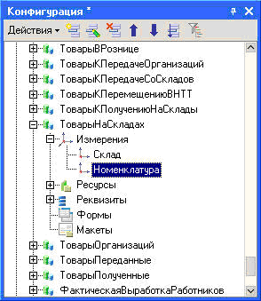

###### #std664

# Режим разделения итогов для регистров накопления

###### 1.

При проектировании регистра накопления учитывайте, что остатки по одному набору измерений хранятся в одном ресурсе.

Из-за этого реальная степень параллельности зависит от состава измерений.
Состав измерений нужно подбирать под прикладную задачу и требуемую «гранулярность» остатков.

###### 2.

Если текущий состав измерений не дает нужной параллельности, используйте разделение итогов (по аналогии с [#std663: регистрами бухгалтерии](663.md)).

Разделение итогов не дает нужного эффекта в части контроля остатков.
Если контроль обязателен, переносите его как можно ближе к концу транзакции (см. [#std661: блокирующее чтение остатков](661.md)).

Рассмотрим регистр `ТоварыНаСкладах`.

!!! example "Состав измерений"

    { width="294" }

###### Пример 1

Два пользователя одновременно записывают движения в регистр.
Первый пользователь записывает:

| № | Склад           | Номенклатура                 |
| - | --------------- | ---------------------------- |
| 1 | Основной склад  | Кресло-качалка              |
| 2 | Основной склад  | Кухонный гарнитур "Тинга-2" |
| 3 | Склад №2        | Мебельный гарнитур "Торэ"   |

Второй пользователь записывает:

| № | Склад          | Номенклатура               |
| - | -------------- | -------------------------- |
| 1 | Основной склад | Мебельный гарнитур "Торэ" |
| 2 | Склад №2       | Кресло-качалка            |

В этих наборах нет строк, совпадающих по всем измерениям, поэтому ожидания блокировки не будет.

###### Пример 2

Теперь второй пользователь записывает:

| № | Склад          | Номенклатура                 |
| - | -------------- | ---------------------------- |
| 1 | Основной склад | Кухонный гарнитур "Тинга-2" |
| 2 | Склад №2       | Кресло-качалка              |
| 3 | Оптовый склад  | Спальный гарнитур "Инга-М"  |

Этот набор содержит строку, совпадающую по всем измерениям со строкой первого пользователя.
В результате возникает ожидание блокировки, и один пользователь ждет завершения операции другого.

###### Пример 3

Если включить разделение итогов, обе записи смогут выполняться параллельно даже при совпадении строк по измерениям.

Но при включенном контроле остатков разделение итогов не даст ожидаемого прироста, и контроль остатков нужно переносить к концу транзакции.

###### См. также

- [#std663: Режим разделения итогов для регистров бухгалтерии](663.md)
- [#std661: Блокирующее чтение остатков в начале транзакции](661.md)
- [Устройство и использование режима разделения итогов регистров (статья на ИТС)](https://its.1c.ru/db/metod81/content/1393/hdoc)
- [#std733: Эффективное обращение к виртуальной таблице «Остатки»](733.md)

###### Источник

https://its.1c.ru/db/v8std#content:664
