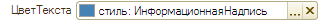
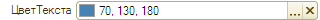
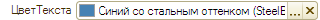
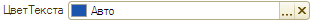
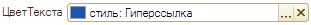
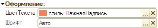
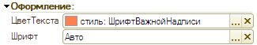

###### #std667

# Элементы стиля

Для каждого элемента управления
оформление по умолчанию задается платформой.

Этих умолчаний следует придерживаться в большинстве случаев,
чтобы обеспечить единообразное оформление форм.

Если нужно визуально выделить отдельный элемент,
изменяйте оформление через элементы стиля,
а не через прямую установку значений в элементе управления.

Это нужно,
чтобы одинаковые элементы выглядели одинаково
во всех формах.

Виды элементов стиля:

- `Цвет` (значение `RGB`);
- `Шрифт` (вид,
  размер,
  начертание);
- `Рамка` (тип и ширина границ).

###### 1.

Элементы стиля нужно использовать всегда,
когда требуется изменить оформление
(`Цвет`, `Шрифт`, `Рамку`),
установленное по умолчанию.

!!! example "Пример"

    Информационные надписи среди других надписей
    можно выделять с помощью цвета.

    Цвет таких надписей следует задавать
    элементом стиля `ИнформационнаяНадпись`,
    а не прямым значением `RGB`
    или выбором цвета `web/windows`.

<div class="std-good-bad-pair" markdown="1">

!!! success "Хорошо"

    { width="320" }

!!! failure "Плохо"

    { width="320" }
    { width="320" }

</div>

###### 2.

Не следует использовать элементы стиля,
чтобы подменять оформление,
которое и так используется в платформе по умолчанию.

!!! example "Пример"

    Для гиперссылок нужно использовать цвет,
    предусмотренный платформой,
    а не создавать отдельный элемент стиля
    с тем же цветом.

<div class="std-good-bad-pair" markdown="1">

!!! success "Хорошо"

    { width="312" }

!!! failure "Плохо"

    { width="311" }

</div>

###### 3.

Каждый элемент стиля создавайте
для конкретной ситуации применения.

Если такой же цвет или шрифт нужен в другой ситуации,
создавайте отдельный элемент стиля.

!!! example "Пример"

    Цвет элемента стиля `ФонУправляющегоПоля`
    следует применять только для фона полей,
    которые влияют на видимость других полей формы.

    Если такой же цвет нужен для поля с другим назначением,
    для него создается отдельный элемент стиля.

###### 4.

Название элемента стиля
должно отражать его назначение.

!!! example "Пример"

    | Название элемента стиля | Назначение |
    | --- | --- |
    | `ФонУправляющегоПоля` | Фон поля, которое управляет видимостью других полей |
    | `ТекстНевыбраннойКартинки` | Текст, который отображается на картинке, пока она не выбрана |

###### 5.

Если есть несколько элементов стиля
с одинаковым названием,
но разным видом,
рекомендуется добавлять вид
(`Цвет`, `Шрифт`, `Рамка`) в имя.

!!! example "Пример"

    `ТекстНевыбраннойКартинкиЦвет`

    `ТекстНевыбраннойКартинкиШрифт`

Вид элемента стиля (`Цвет`, `Шрифт`, `Рамка`)
следует указывать после базового названия.
Так элемент проще найти по первым буквам в списке.

<div class="std-good-bad-pair" markdown="1">

!!! success "Хорошо"

    ```text
    ПросроченныеДанныеЦвет
    ПросроченныеДанныеШрифт
    ```

!!! failure "Плохо"

    ```text
    ЦветПросроченныхДанных
    ШрифтПросроченныхДанных
    ```

</div>

В названии элемента стиля
нужно указывать только тот вид,
который действительно используется.

!!! example "Пример"

    Для элемента стиля вида `Цвет`
    не следует включать в название слово `Шрифт`.

<div class="std-good-bad-pair" markdown="1">

!!! success "Хорошо"

    `ВажнаяНадпись`

    { width="320" }

!!! failure "Плохо"

    `ШрифтВажнойНадписи`

    { width="325" }

</div>

## Элементы стиля с видом "Цвет"

| Элемент стиля | Значение (RGB) | В каком стандарте используется |
| --- | --- | --- |
| `ПросроченныеДанные` | `RGB: 178,34,34` <span class="std-rgb-dot" style="--std-rgb-color: 178,34,34;" title="RGB: 178,34,34"></span> | [#std584: Акцентирование внимания на просроченных или критичных состояниях](584.md), [#std613: Итоги в документах](613.md) |
| `ПояснениеОтсутствующейГиперссылки` | `RGB: 128,128,128` <span class="std-rgb-dot" style="--std-rgb-color: 128,128,128;" title="RGB: 128,128,128"></span> | [#std595: Гиперссылка на счет-фактуру](595.md) |
| `ТекстЗапрещеннойЯчейки` | `RGB: 192,192,192` <span class="std-rgb-dot" style="--std-rgb-color: 192,192,192;" title="RGB: 192,192,192"></span> | [#std610: Пояснение невозможности заполнения ячеек в табличных частях](610.md) |
| `ИтоговыеПоказателиДокументов` | `RGB: 22,39,121` <span class="std-rgb-dot" style="--std-rgb-color: 22,39,121;" title="RGB: 22,39,121"></span> | [#std613: Итоги в документах](613.md) |
| `ИтогиЖурналаЦвет` | `RGB: 100,100,100` <span class="std-rgb-dot" style="--std-rgb-color: 100,100,100;" title="RGB: 100,100,100"></span> | [#std614: Итоги в журналах документов](614.md) |
| `ФонУправляющегоПоля` | `RGB: 255,232,179` <span class="std-rgb-dot" style="--std-rgb-color: 255,232,179;" title="RGB: 255,232,179"></span> | [#std631: Поле, влияющее на состав остальных полей в форме](631.md) |
| `ТекстНевыбраннойКартинкиЦвет` | `RGB: 220,220,220` <span class="std-rgb-dot" style="--std-rgb-color: 220,220,220;" title="RGB: 220,220,220"></span> | [#std635: Невыбранная картинка](635.md) |
| `НегативноеСобытие` | `RGB: 178,34,34` <span class="std-rgb-dot" style="--std-rgb-color: 178,34,34;" title="RGB: 178,34,34"></span> | [#std676: Отчеты вида "таблица", "список"](676.md) |
| `ПозитивноеСобытие` | `RGB: 0,128,0` <span class="std-rgb-dot" style="--std-rgb-color: 0,128,0;" title="RGB: 0,128,0"></span> | [#std676: Отчеты вида "таблица", "список"](676.md) |
| `НеактуальнаяИнформация` | `RGB: 255,200,200` <span class="std-rgb-dot" style="--std-rgb-color: 255,200,200;" title="RGB: 255,200,200"></span> | [#std676: Отчеты вида "таблица", "список"](676.md) |
| `Диаграмма` | `RGB: 70,130,180` <span class="std-rgb-dot" style="--std-rgb-color: 70,130,180;" title="RGB: 70,130,180"></span> | [#std675: Отчеты вида "диаграмма"](675.md) |
| `Прогноз` | `RGB: 199,21,133` <span class="std-rgb-dot" style="--std-rgb-color: 199,21,133;" title="RGB: 199,21,133"></span> | [#std675: Отчеты вида "диаграмма"](675.md) |
| `ПоясняющийТекст` | `RGB: 128,122,89` <span class="std-rgb-dot" style="--std-rgb-color: 128,122,89;" title="RGB: 128,122,89"></span> | [#std615: Рабочее место](615.md) |

## Элементы стиля с видом "Шрифт"

| Элемент стиля | Значение (шрифт, размер, начертание) | В каком стандарте используется |
| --- | --- | --- |
| `ОсновнойЭлементСписка` | Обычный шрифт текста, начертание `Полужирный` | [#std594: Значения по умолчанию](594.md) |
| `ОсновноеИтоговоеЗначение` | Обычный шрифт текста, начертание `Полужирный` | [#std613: Итоги в документах](613.md) |
| `ИтогиЖурналаШрифт` | Обычный шрифт текста, начертание `Полужирный` | [#std614: Итоги в журналах документов](614.md) |
| `ТекстНевыбраннойКартинкиШрифт` | Обычный шрифт текста, размер `12` | [#std635: Невыбранная картинка](635.md) |

###### Проверки
~[#bslls:StyleElementConstructors](../diagnostics/bslls/StyleElementConstructors.md)~

###### Источник

https://its.1c.ru/db/v8std#content:667
