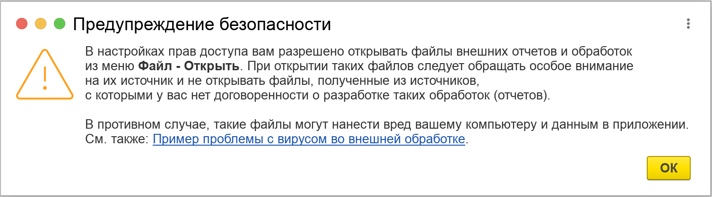
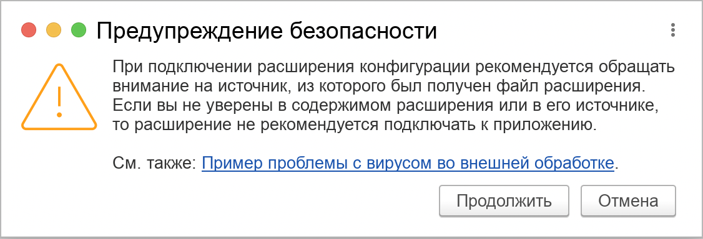
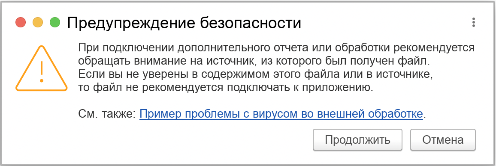
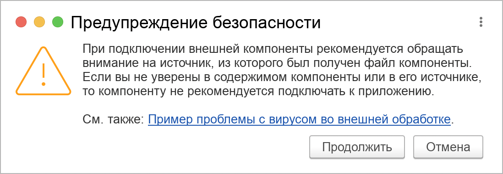

###### #std669

# Ограничение на выполнение "внешнего" кода

Внешний код может быть подключен с помощью:

- внешних отчетов
- внешних обработок
- расширений конфигурации
- внешних компонент
- другими способами (какими?)

Внешний код может содержать деструктивные действия:

- в самом коде выполнить действие
- запустить внешнее приложение
- внешнюю компоненту
- создать COM-объект

Пример уязвимости [Информация для пользователей и партнеров №21537 от 22.06.2016](https://1c.ru/news/info.jsp?id=21537)

###### 1.
Запрещено выполнение на сервере в небезопасном режиме любого кода, который не является частью программы.

Запускать можно код, прошедший аудит.
Или код на клиенте.

!!! example "Например"

    - внешние отчеты и обработки, расширения, внешние компоненты, любые аналоги подключения внешнего кода
    - алгоритмы на встроенном языке, тексты запросов и фрагменты текстов запросов, используемые в методах `#!bsl Выполнить` и `#!bsl Вычислить`. См. [#std770: Ограничения на использование Выполнить и Вычислить на сервере](770.md)
    - изменение схем компоновки данных, в которых разрешено использование внешних функций, а так же загрузку схем компновки данных из файлов

При использовании БСП внешний код надо подключать только средствами БСП:

- расширения - через механизм базовой функциональности
- внешние отчеты и обработки - через подсистему "Дополнительные отчеты и обработки"
- внешние компоненты - через подсистуму "Внешние компоненты"
- для запуска внешних программ -  См. [#std774: Безопасность запуска приложений](774.md)

###### 2.

По умолчанию требуется отключить интерактивное открытие внешних отчетов и обработок через меню __Файл - Открыть__. В том числе у администратора.

См. пп. 2.2 и 2.3 [#std488: Стандартные роли](488.md)

Администратор может разрешить интерактивное открытие.

!!! example "При интерактивном открытии надо уведомлять об опасности действия"
    { width="600" }

###### 3.

Предупреждайте администратора об опасности подключения любого внешнего кода.

###### 3.1.

Предупреждение должно содержать:

!!! quote "Цитата"

    Внешний код, полученный из недостоверных источников (с которыми, например, нет договоренности о разработке такого кода), может нанести вред компьютерам пользователей, серверным компьютерам, а также данным в программе.

Дайте возможность администратору прервать загрузку, провести аудит, а потом заново повторить загрузку.

!!! example "При загрузке расширения"
    { width="500" }

!!! example "При загрузке дополнительной обработки"  
    { width="500" }

!!! example "При загрузке внешней компоненты"
    { width="500" }

###### 3.2.

Подключенный администратором внешний код другие пользователи могут использовать без предупреждений.

Механизм защиты от опасных действий платформы во всех случаях отключать запрещено.

[Руководство разработчика 7.10.2. Отключение механизма защиты от опасных действий](https://its.1c.ru/db/v8327doc/bookmark/dev/ti000001873)

###### 4.
Средства обновления конфигурации (из файлов .cf или .cfu), средства восстановления из резервной копии или загрузки из dt-файла 

- должны быть доступны только администратору
- должно выполняться только интерактивно
- администратору надо показать предупреждение
- при получении обновления из сети Интернет, надо использовать защищенное соединение

###### 5.

Произвольные файлы могут содержать вредоносный код.

Предусмотрите блокировку загрузки файлов по списку разрешенных (запрещенных) расширений.

Открывать исполняемые файлы из программы запрещено. Даже если их разрешено загрузить и хранить в программе.

Вредоносный код может содержаться в макросах Microsoft Office. При работе с такими файлами используйте средства безопасности, заложенные в их программы просмотра. См [#std775: Безопасность программного обеспечения, вызываемого через открытые интерфейсы](775.md)

Используйте БСП подсистему "Работа с файлами".

###### 6.
Безопасность внешних компонент.

###### 6.1.
Внешние компоненты можно размещать:

- в макетах конфигурации - они являются частью конфигурации
- сторонние - они потенциально опасны

Сторонние внешние компоненты, предназначенные для подключения на сервере, устанавливать должен только администратор.

Внешние компоненты, предназначенные для подключения на клиенте, устанавливать может любой пользователь, с показом предупреждения.

###### 6.2.
Сторонние внешние компоненты должны храниться в специальном справочнике.
Запись в такой справочник должен иметь только администратор.
Подключать сторонние внешние компоненты допустимо только по навигационной ссылке на реквизит справочника.

Не подключайте сторонние внешние компоненты по имени файла или по идентификатору программы. Так компоненту легко подменить.

###### 6.3.
Внешние компоненты в составе конфигурации должены хранится в макетах типа "Внешняя компонента". Макет не локализуется. Компоненты должны локализовываться через интерфейс компоненты.

###### 6.4.
Используйте БСП для подключение внешних компонент.

!!! failure "Неправильно"

    ```bsl
    ПодключитьВнешнююКомпоненту(...)
    НачатьУстановкуВнешнейКомпоненты(...)
    УстановитьВнешнююКомпоненту(...)
    НачатьПодключениеВнешнейКомпоненты(...)
    ЗагрузитьВнешнююКомпоненту(...)
    ```

!!! example "Для подключения компоненты из макета"
    ```bsl
    ОбщегоНазначенияКлиент.ПодключитьКомпонентуИзМакета
    ```

!!! example "Для подключения компоненты из макета на сервере"
    ```bsl
    ОбщегоНазначения.ПодключитьКомпонентуИзМакета
    ```

!!! example "Для подключения компонент из хранилища внешних компонент"
    ```bsl
    ВнешниеКомпонентыКлиент.ПодключитьКомпоненту
    ```

!!! example "Для подключения компонент из хранилища внешних компонент на сервере"
    ```bsl
    ВнешниеКомпоненты.ПодключитьКомпоненту
    ```

###### 7.
Загружать код из внешнего удаленного источника следует:

- если источник надежен, когда ему доверяем
- только по защищенным каналам
- защищенный канал должен быть с проверкой подлинности сервера

!!! example "Пример установки защищенного соединения с проверной подлинности сервера"
    ```bsl
    ЗащищенноеСоединение = Новый ЗащищенноеСоединениеOpenSSL(, Новый СертификатыУдостоверяющихЦентровОС);
    Соединение = Новый HTTPСоединение(Сервер,,,,,, ЗащищенноеСоединение);
    ```

Вне зависимости от протокола и типа канала, канал должен быть защищенным: `#!bsl HTTPСоединение`, `#!bsl FTPСоединение`, `#!bsl WSПрокси`, `#!bsl WSОпределения`, `#!bsl WSСсылкаМенеджер.СоздатьWSПрокси`.

!!! example "В БСП есть конструктор защищенного соединения"
    ```bsl
    ЗащищенноеСоединение = ОбщегоНазначенияКлиентСервер.НовоеЗащищенноеСоединение();
    Соединение = Новый HTTPСоединение(Сервер,,,,,, ЗащищенноеСоединение);
    ```

###### 8.
Регламентные задания по-умолчанию запускаются под полными правами.
Установка безопасного режима не уменьшает прав пользователя.

Ограничивайте права в сеансе регламантного задания. Для этого программно создайте и укажите служебного пользователя.

Стратегии ограничения прав:

- пустой список ролей, вычисления без прав, чтение и изменение выполнять в привилегированном режиме установленном вручную, исполнение произвольного кода производить в безопасном режиме
- назначить реального пользователя (для одноразовых заданий ок)
- создавать специальный профиль и специальные роли для чтения таблиц

Для БСП в подсистеме "Регламентные задания" в начале обработчика регламентного задания разместите код:

!!! example "В БСП есть установка служебного пользователя"
    ```bsl
    РегламентныеЗаданияСервер.УстановитьСлужебногоПользователяРегламентногоЗадания
    ```


###### См. также

- [#std770: Ограничения на использование Выполнить и Вычислить на сервере](770.md)
- [Облачные технологии](https://v8.1c.ru/platforma/oblachnye-tehnologii/)
- [#std678: Безопасность прикладного программного интерфейса сервера](678.md)
- [#std485: Использование привилегированного режима](485.md)

###### Источник

https://its.1c.ru/db/v8std#content:669