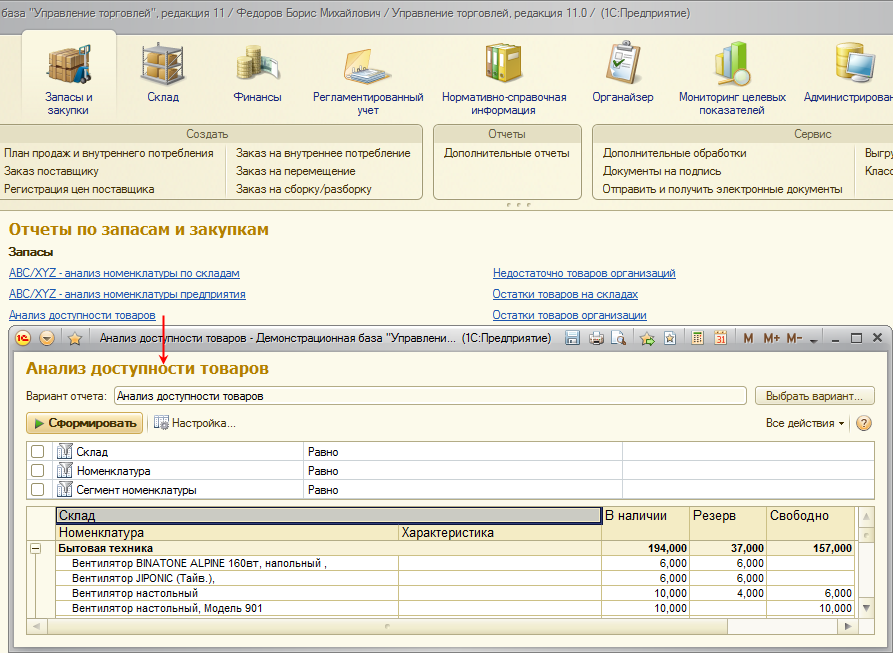
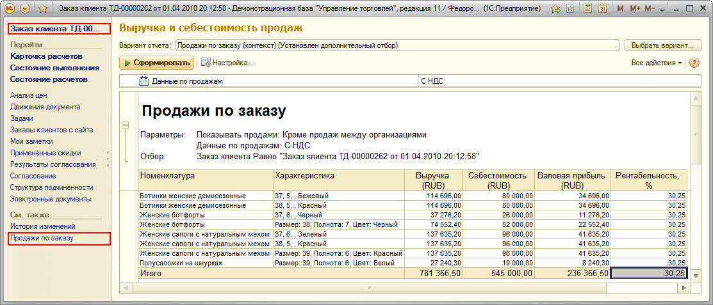

###### #std670

# Содержание отчета

###### 1. 

Показатели отчета

###### 1.1.

Отчет может одновременно содержать несколько показателей:
финансовых или нефинансовых,
числовых или качественных.

Их состав должен соответствовать назначению отчета
(цели анализа).

###### 1.2.

В отчет включаются только те показатели,
которые связаны общей целью анализа.

###### 1.3.

В отчетах,
реализованных без использования СКД,
рекомендуется обеспечивать расшифровку
всех выводимых показателей.

###### 1.4.

Отчеты не должны содержать данные,
помеченные на удаление.

Если такие данные нужно выводить,
их следует выделять явным образом
(см. [#std676: Отчеты вида "таблица", "список", п. 3.5](676.md)).

###### 2. 

Валюты

###### 2.1.

При включении показателя в отчет учитывайте,
что он может принимать значения в разных валютах.

Для сравнительного анализа
валюта показателя должна быть единой
в пределах отчета.

###### 2.2.

Если назначение отчета предполагает анализ показателя
в разных валютах,
выводите одновременно:

- значение в исходной валюте;
- значение в приведенной,
  единой валюте отчета.

!!! example "Пример"

    В отчете `Анализ расчетов с клиентами`
    расчеты могут быть в разных валютах.

    Чтобы оценить общий объем задолженности,
    суммы задолженности по всем клиентам
    приводятся к единой валюте отчета,
    например,
    к валюте управленческого
    или регламентированного учета
    (в зависимости от конфигурации).

###### 3. 

Контекстные и неконтекстные отчеты

###### 3.1.

Отчеты и варианты отчетов
могут быть предназначены
для разных контекстов работы.

Неконтекстный отчет - отчет,
который запускается из командного интерфейса конфигурации
(например,
из панели отчетов)
вне конкретного объекта анализа.

Он запускается
либо со стандартными,
либо с ранее сохраненными пользовательскими настройками.

{ width="893" }

Контекстный отчет - отчет,
который запускается из панели навигации
конкретного объекта учета
(документа,
элемента справочника).

При запуске автоматически настраиваются отборы и параметры,
поэтому отчет содержит информацию,
относящуюся только к выбранному объекту.

{ width="1113" }

###### 3.2.

Если используются варианты отчетов,
пользователь не должен иметь возможности
выбирать в списке вариантов контекстные варианты отчета
(в том числе в панели отчетов).

###### 3.3.

В контекстных отчетах
следует исключать из группировок объект анализа
(контекст).

!!! example "Пример"

    Группировка валовой прибыли по заказам клиентов не нужна,
    если отчет запущен в контексте конкретного заказа клиента.

###### 3.4.

При использовании СКД
имя контекстного варианта отчета
должно содержать слово `Контекст`.

!!! example "Пример"

    `ДвиженияСерийНоменклатурыКонтекст`
    для отчета `ДвиженияСерийТоваров`.

###### Источник

https://its.1c.ru/db/v8std#content:670
